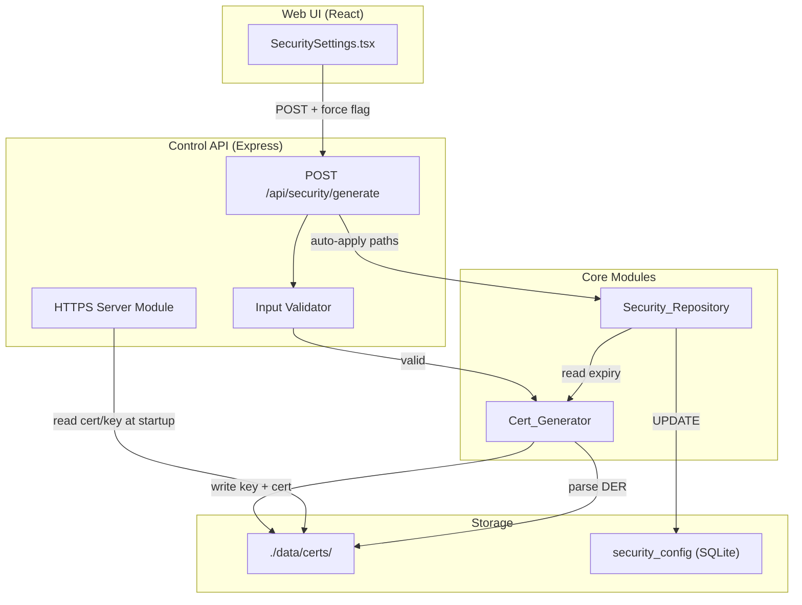
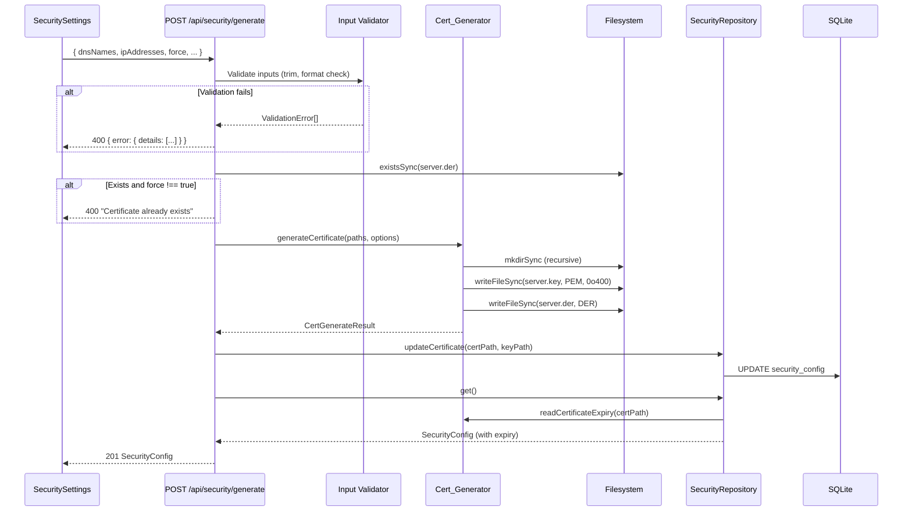

# Design Document: In-App Self-Signed Certificate Generation

## Overview

This feature extends the OPC UA Light Server with in-app self-signed X.509 certificate generation, enabling secure communication without external PKI infrastructure. The implementation uses the existing `node-forge` dependency (already in `package.json`) to generate 2048-bit RSA key pairs and self-signed certificates with OPC UA-specific extensions (Application URI in SAN).

The feature spans three layers:
1. **Cert_Generator module** (`src/cert-generator/index.ts`) — Pure certificate generation logic with input validation, file output, and expiry reading
2. **Security API route** (`src/api/routes/security.ts`) — REST endpoint orchestrating generation with force-flag protection, input validation, and auto-apply to security config
3. **Security Settings UI** (`web/src/components/SecuritySettings.tsx`) — React form with SAN inputs, confirmation dialog, and certificate health display

Additionally, the Control API server gains conditional HTTPS support using the generated certificate when security mode is `Sign` or `SignAndEncrypt`.

### Design Rationale

- **node-forge over OpenSSL CLI**: Avoids system dependency, works cross-platform, already in the project
- **DER format for certificate**: Required by the open62541 C runtime for OPC UA security
- **PEM format for private key**: Standard interchange format, easily consumed by Node.js `https` module
- **Force flag pattern**: Prevents accidental certificate rotation in production industrial environments
- **Auto-apply after generation**: Eliminates the manual step of uploading paths after generation, reducing operator error

## Architecture



### Request Flow



## Components and Interfaces

### 1. Cert_Generator Module

**File**: `src/cert-generator/index.ts`

The existing module is enhanced with:
- Input validation (IP format, DNS format, country code format)
- Whitespace trimming on string inputs
- Guaranteed 127.0.0.1 inclusion in SAN IPs
- File permission setting (0o400 for private key on POSIX)
- Atomic-style cleanup on partial failure
- Serial number with 8-20 byte random length

```typescript
// Enhanced interfaces (extending existing)

export interface CertGenerateOptions {
  applicationUri?: string;
  validityDays?: number;
  dnsNames?: string[];
  ipAddresses?: string[];
  organization?: string;
  country?: string;
  commonName?: string;
}

export interface CertGenerateResult {
  certificatePath: string;
  privateKeyPath: string;
  expiresAt: string;
  createdAt: string;
}

export interface CertExpiryInfo {
  expiresAt: string;
  createdAt: string;
  remainingDays: number;
}

// New validation function
export interface ValidationError {
  field: string;
  message: string;
}

export function validateCertificateOptions(options: CertGenerateOptions): ValidationError[];
export function generateCertificate(certPath: string, keyPath: string, options?: CertGenerateOptions): CertGenerateResult;
export function readCertificateExpiry(certPath: string): CertExpiryInfo | null;
```

### 2. Input Validator

**File**: `src/cert-generator/validation.ts` (new)

Extracted validation logic to keep the generator focused on certificate creation:

```typescript
export function validateIpAddress(ip: string): boolean;    // IPv4 dotted-decimal or IPv6
export function validateDnsName(dns: string): boolean;      // hostname chars, ≤253 chars
export function validateCountryCode(code: string): boolean; // exactly 2 uppercase A-Z
export function validateCommonName(cn: string): boolean;    // 1-64 chars after trim
export function validateOrganization(org: string): boolean; // 1-64 chars after trim

export function validateGenerateRequest(body: GenerateCertificateRequest): ValidationError[];
```

### 3. Security API Route Enhancement

**File**: `src/api/routes/security.ts`

The existing `POST /generate` handler is enhanced with:
- Proper input validation using the new validator (returning all errors at once)
- Whitespace trimming before validation
- Non-boolean `force` treated as not-set
- Correct HTTP 201 on success

### 4. HTTPS Server Module

**File**: `src/api/https-server.ts` (new)

Conditional HTTPS support added to the server startup:

```typescript
export interface HttpsConfig {
  certPath: string;
  keyPath: string;
}

export function createHttpsServer(app: Express, config: HttpsConfig): https.Server;
export function shouldUseHttps(securityConfig: SecurityConfig): boolean;
```

### 5. Security Settings UI Enhancement

**File**: `web/src/components/SecuritySettings.tsx`

Enhanced with:
- Certificate remaining days display with color-coded indicators (top section)
- "Generate Certificate" button with optional SAN form inputs
- Confirmation dialog when overwriting existing certificate
- Client-side validation for DNS names and IP addresses

## Data Models

### Certificate Generation Request (API DTO)

```typescript
interface GenerateCertificateRequest {
  dnsNames?: string[];        // Optional SAN DNS entries (max 20, each ≤253 chars)
  ipAddresses?: string[];     // Optional SAN IP entries (max 20, valid IPv4/IPv6)
  organization?: string;      // Optional org name (≤64 chars after trim)
  country?: string;           // Optional 2-letter uppercase country code
  commonName?: string;        // Optional CN (≤64 chars after trim, default: "OPC UA Light Server")
  force?: boolean;            // Required true to overwrite existing cert
}
```

### Security Config (Domain Model + Response)

```typescript
interface SecurityConfig {
  mode: 'None' | 'Sign' | 'SignAndEncrypt';
  certificatePath?: string;
  certificateValid?: boolean;
  privateKeyConfigured: boolean;
  certificateExpiresAt?: string;       // ISO 8601 (e.g., "2031-06-09T12:00:00.000Z")
  certificateRemainingDays?: number;   // Non-negative integer (0 if expired)
}
```

### SQLite Schema (existing `security_config` table)

```sql
CREATE TABLE IF NOT EXISTS security_config (
  id INTEGER PRIMARY KEY DEFAULT 1,
  mode TEXT NOT NULL DEFAULT 'None',
  certificate_path TEXT,
  private_key_path TEXT,
  updated_at TEXT DEFAULT (datetime('now'))
);
```

No schema changes needed — the existing table supports storing certificate and key paths.

### File System Layout

```
./data/certs/
├── server.der    # X.509 certificate in DER format (binary)
└── server.key    # RSA private key in PEM format (owner-read-only)
```

## Correctness Properties

*A property is a characteristic or behavior that should hold true across all valid executions of a system — essentially, a formal statement about what the system should do. Properties serve as the bridge between human-readable specifications and machine-verifiable correctness guarantees.*

### Property 1: Self-Signed Certificate (Issuer Equals Subject)

*For any* valid `GenerateCertificateRequest` input (commonName 1-64 chars, organization 1-64 chars, country exactly 2 uppercase letters), the generated certificate SHALL have identical issuer and subject distinguished name fields.

**Validates: Requirements 2.3, 11.1**

### Property 2: Validity Period Exactness

*For any* generated certificate, the difference between `notAfter` and `notBefore` dates SHALL be exactly 1825 days (measured as milliseconds divided by 86,400,000, rounded to nearest integer).

**Validates: Requirements 2.1, 11.2**

### Property 3: Key-Pair Consistency

*For any* generated certificate and its corresponding private key, the certificate's public key modulus SHALL be identical to the private key modulus.

**Validates: Requirements 1.1, 11.3**

### Property 4: Distinguished Name Preservation

*For any* valid commonName (1-64 non-whitespace chars), organization (1-64 non-whitespace chars), and country code (2 uppercase ASCII letters) provided in the request, the generated certificate subject SHALL contain those exact values in the corresponding CN, O, and C fields.

**Validates: Requirements 2.4, 2.6, 2.8**

### Property 5: SAN Minimum Entries

*For any* generated certificate regardless of input options, the Subject Alternative Name extension SHALL contain at minimum the Application URI (`urn:opcua-light-server:application`) as a URI entry and `127.0.0.1` as an IP entry.

**Validates: Requirements 3.1, 3.4, 3.6**

### Property 6: SAN IP Completeness

*For any* non-empty array of valid IPv4 addresses provided in `ipAddresses`, the generated certificate SAN SHALL include every provided IP address plus `127.0.0.1`.

**Validates: Requirements 3.2, 11.4**

### Property 7: SAN DNS Completeness

*For any* non-empty array of valid DNS names provided in `dnsNames`, the generated certificate SAN SHALL include every provided DNS name as a DNS entry.

**Validates: Requirements 3.5**

### Property 8: Invalid IP Rejection

*For any* string that does not match a valid IPv4 dotted-decimal format (four octets 0-255 separated by dots), the validation function SHALL reject the input with an error indicating the invalid `ipAddresses` field.

**Validates: Requirements 3.7, 9.1**

### Property 9: Invalid DNS Name Rejection

*For any* DNS name that is an empty string (after trimming) or exceeds 253 characters, the validation function SHALL reject the input with an error indicating the invalid `dnsNames` field.

**Validates: Requirements 3.8, 9.3**

### Property 10: Invalid Country Code Rejection

*For any* country code string that is not exactly two uppercase ASCII letters (A-Z), the validation function SHALL reject the input with an error indicating the invalid `country` field.

**Validates: Requirements 9.2**

### Property 11: Whitespace Trimming Idempotence

*For any* valid input with additional leading/trailing whitespace on `commonName`, `organization`, `country`, or entries in `dnsNames`/`ipAddresses`, the generation result SHALL be identical to the result without the extra whitespace (after trimming).

**Validates: Requirements 9.4**

### Property 12: Certificate Expiry Read Round-Trip

*For any* freshly generated certificate, calling `readCertificateExpiry` on the output DER file SHALL return a non-null result with `remainingDays` between 1824 and 1825 inclusive, and `expiresAt` as a valid ISO 8601 timestamp.

**Validates: Requirements 6.1, 6.2, 11.5**

### Property 13: Serial Number Byte Length

*For any* generated certificate, the serial number SHALL be a positive integer of at least 8 bytes and at most 20 bytes in length.

**Validates: Requirements 2.2**

## Error Handling

### Cert_Generator Errors

| Scenario | Behavior |
|----------|----------|
| Invalid IP address in options | Throws `ValidationError` with field detail before generation starts |
| Invalid DNS name in options | Throws `ValidationError` with field detail before generation starts |
| Directory creation fails (permissions) | Throws error with path info, no partial files left |
| Key file write fails | Throws error, no files remain |
| Certificate file write fails | Throws error, removes already-written key file (cleanup) |
| Certificate read fails (missing/corrupt) | Returns `null` — no throw |
| Expired certificate | Returns `remainingDays: 0` — no throw |

### Security API Errors

| Scenario | HTTP Status | Error Code | Details |
|----------|-------------|------------|---------|
| Input validation failure (one or more fields) | 400 | `VALIDATION_ERROR` | Array with one entry per invalid field |
| Certificate exists, force !== true | 400 | `VALIDATION_ERROR` | Message: "Certificate already exists" |
| Filesystem/generation failure | 500 | `INTERNAL_ERROR` | Original error message; DB unchanged |

### HTTPS Server Errors

| Scenario | Behavior |
|----------|----------|
| Certificate file unreadable at startup | Fall back to HTTP, log warning |
| Private key file unreadable at startup | Fall back to HTTP, log warning |
| Invalid cert/key combination | Fall back to HTTP, log warning |

### UI Error States

| Scenario | User-Facing Behavior |
|----------|---------------------|
| Generation API returns 400 | Display error message from response |
| Generation API returns 500 | Display generic error with server message |
| Network failure during generation | Display "Network error" message |
| Client-side validation failure | Inline field errors, button stays disabled |

## Testing Strategy

### Property-Based Tests (fast-check)

**Library**: `fast-check` 3 (already in devDependencies)
**Location**: `tests/property/cert-generator.test.ts`
**Configuration**: Minimum 100 iterations per property, 30s timeout (configured in vitest workspace)

Each property test maps directly to a Correctness Property above:

| Property | Test Tag |
|----------|----------|
| Property 1 | `Feature: cert-generation, Property 1: Self-signed issuer equals subject` |
| Property 2 | `Feature: cert-generation, Property 2: Validity period exactly 1825 days` |
| Property 3 | `Feature: cert-generation, Property 3: Key-pair modulus consistency` |
| Property 4 | `Feature: cert-generation, Property 4: Distinguished name preservation` |
| Property 5 | `Feature: cert-generation, Property 5: SAN minimum entries` |
| Property 6 | `Feature: cert-generation, Property 6: SAN IP completeness` |
| Property 7 | `Feature: cert-generation, Property 7: SAN DNS completeness` |
| Property 8 | `Feature: cert-generation, Property 8: Invalid IP rejection` |
| Property 9 | `Feature: cert-generation, Property 9: Invalid DNS rejection` |
| Property 10 | `Feature: cert-generation, Property 10: Invalid country code rejection` |
| Property 11 | `Feature: cert-generation, Property 11: Whitespace trimming idempotence` |
| Property 12 | `Feature: cert-generation, Property 12: Expiry read round-trip` |
| Property 13 | `Feature: cert-generation, Property 13: Serial number byte length` |

**Generators needed**:
- `validCommonName()`: Arbitrary string 1-64 printable chars (no leading/trailing whitespace)
- `validOrganization()`: Arbitrary string 1-64 printable chars
- `validCountryCode()`: Arbitrary 2-char uppercase ASCII [A-Z]
- `validIpv4()`: Four octets 0-255 joined by dots
- `validDnsName()`: 1-253 chars from `[a-zA-Z0-9.-]` with valid hostname structure
- `invalidIpv4()`: Strings that don't match IPv4 format (missing octets, out-of-range, alpha chars)
- `invalidDnsName()`: Empty strings, strings >253 chars, strings with invalid characters
- `invalidCountryCode()`: Strings that aren't exactly 2 uppercase ASCII letters

### Unit Tests

**Location**: `tests/unit/cert-generator.test.ts`, `tests/unit/security-route.test.ts`

Focus areas:
- Default value behavior (missing CN → "OPC UA Light Server", missing org → omitted)
- Force flag edge cases (force=undefined, force="true", force=1)
- Filesystem error handling (mocked fs failures, cleanup verification)
- Write ordering (key before cert)
- File permissions (0o400 on POSIX)
- Aggregated validation errors (multiple invalid fields → single response)
- Auto-apply flow (generation → DB update → response with expiry)

### Component Tests

**Location**: `tests/components/SecuritySettings.test.tsx`

Focus areas:
- "Generate Certificate" button renders
- SAN input fields (DNS, IP) with validation
- Confirmation dialog when cert exists
- Loading state during generation
- Success notification and cache invalidation
- Error display on failure
- Certificate remaining days display with color indicators (green >90, yellow 30-90, red <30, "Expired" =0)
- Expiry date display in ISO 8601 format

### Integration Tests

**Location**: `tests/integration/security-generate.test.ts`

Focus areas:
- Full POST /api/security/generate flow with real filesystem (temp directory)
- Database state verification after generation
- HTTPS server startup with generated certificate
- HTTP fallback when cert is unreadable
