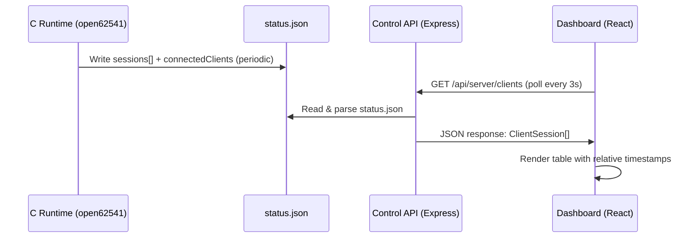

# Design Document: Connected Clients Dashboard

## Overview

This feature extends the existing Server Dashboard to provide per-client session visibility. Today, the dashboard shows only a numeric count of connected OPC UA clients. After this feature, operators will see a detailed table with each client's application name, URI, security policy, IP address, connection duration, and session state.

The data flow is:

1. The C runtime (open62541) writes session details into `status.json` alongside the existing `connectedClients` count
2. The Control API reads `status.json` and exposes a new `GET /api/server/clients` endpoint
3. The React Dashboard polls this endpoint and renders a table with auto-refresh

This design maintains full backward compatibility — the existing `connectedClients` field and `/api/server/status` endpoint remain unchanged.

## Architecture



The architecture follows the existing pattern where the runtime writes status to a file and the Control API reads it. No new IPC mechanisms are introduced.

### Key Design Decisions

1. **File-based communication (status.json)** — Consistent with the existing `connectedClients` pattern. The runtime already writes this file periodically; we extend it with a `sessions` array.
2. **Separate endpoint (`/api/server/clients`)** — Rather than embedding session details in the existing `/api/server/status` response, a dedicated endpoint keeps the status response lightweight and avoids breaking existing consumers.
3. **Polling from the frontend** — TanStack React Query already polls `/api/server/status` every 5 seconds. The clients endpoint will use a similar pattern (3-second interval for near real-time updates).
4. **No authentication** — Consistent with the existing status endpoint (Requirement 2.5).

## Components and Interfaces

### 1. Runtime Status File Extension

The C runtime extends `status.json` with a `sessions` field:

```json
{
  "connectedClients": 2,
  "sessions": [
    {
      "applicationName": "UaExpert",
      "applicationUri": "urn:UnifiedAutomation:UaExpert",
      "securityPolicyUri": "http://opcfoundation.org/UA/SecurityPolicy#None",
      "clientAddress": "192.168.1.50:54321",
      "connectTime": "2024-01-15T10:30:00.000Z",
      "sessionState": "Activated"
    }
  ]
}
```

### 2. TypeScript Type Definition

Added to `src/types/index.ts`:

```typescript
/** Session state for a connected OPC UA client. */
export type ClientSessionState = 'Created' | 'Activated' | 'Closing';

/** A connected OPC UA client session as reported by the runtime. */
export interface ClientSession {
  applicationName: string;
  applicationUri: string;
  securityPolicyUri: string;
  clientAddress: string;
  connectTime: string; // ISO 8601
  sessionState: ClientSessionState;
}
```

### 3. Status File Reader (Extension to ProcessManager)

A new method `readClientSessions(): ClientSession[]` on the `ProcessManager` class reads and validates sessions from `status.json`. This follows the same pattern as the existing `readConnectedClients()` private method but returns structured data.

```typescript
/** Read client sessions from the runtime's status.json file. */
readClientSessions(): ClientSession[] {
  // Read file, parse JSON, validate sessions array, return typed result
  // Returns [] if: file doesn't exist, field is missing, runtime not running
}
```

### 4. API Route: GET /api/server/clients

Added to the existing `createServerRouter` in `src/api/routes/server.ts`:

```typescript
router.get('/clients', (req: Request, res: Response): void => {
  try {
    const sessions = processManager.readClientSessions();
    res.status(200).json(sessions);
  } catch (err) {
    res.status(500).json({ error: { code: 'INTERNAL_ERROR', message: '...' } });
  }
});
```

### 5. Web API Client Function

Added to `web/src/api.ts`:

```typescript
export interface ClientSession {
  applicationName: string;
  applicationUri: string;
  securityPolicyUri: string;
  clientAddress: string;
  connectTime: string;
  sessionState: 'Created' | 'Activated' | 'Closing';
}

export function getConnectedClients(): Promise<ClientSession[]> {
  return request<ClientSession[]>('/server/clients');
}
```

### 6. ConnectedClientsTable Component

A new React component `web/src/components/ConnectedClientsTable.tsx` renders the sessions table. It is embedded within the existing `Dashboard.tsx` component, conditionally shown when the server is running.

```typescript
interface ConnectedClientsTableProps {
  sessions: ClientSession[];
}

export function ConnectedClientsTable({ sessions }: ConnectedClientsTableProps) {
  // Renders table with columns: App Name, App URI, Security Policy, Address, Connected, State
  // Shows "No clients connected" message when sessions is empty
}
```

### 7. Duration Formatting Utility

A pure function `formatRelativeDuration(isoTimestamp: string): string` converts an ISO 8601 timestamp to a human-readable relative duration string (e.g., "5m 30s", "2h 15m", "3d 4h").

```typescript
/** Format an ISO timestamp as a human-readable relative duration from now. */
export function formatRelativeDuration(isoTimestamp: string): string {
  const elapsed = Date.now() - new Date(isoTimestamp).getTime();
  // Returns formatted string like "5m 30s", "2h 15m", "3d 4h"
}
```

### 8. Session Validator

A pure function that validates raw JSON data from the status file into typed `ClientSession` objects, filtering out any malformed entries:

```typescript
/** Validate and filter raw session data from status.json. */
export function validateSessions(raw: unknown): ClientSession[] {
  // Validates each entry has all required fields with correct types
  // Filters out invalid entries rather than throwing
  // Returns only valid ClientSession objects
}
```

## Data Models

### ClientSession Interface

| Field | Type | Description | Example |
|-------|------|-------------|---------|
| `applicationName` | `string` | Client application display name | `"UaExpert"` |
| `applicationUri` | `string` | Client application URI | `"urn:UnifiedAutomation:UaExpert"` |
| `securityPolicyUri` | `string` | Negotiated security policy | `"http://opcfoundation.org/UA/SecurityPolicy#None"` |
| `clientAddress` | `string` | Remote IP:port | `"192.168.1.50:54321"` |
| `connectTime` | `string` | ISO 8601 timestamp | `"2024-01-15T10:30:00.000Z"` |
| `sessionState` | `ClientSessionState` | Session lifecycle state | `"Activated"` |

### ClientSessionState Enum

| Value | Description |
|-------|-------------|
| `"Created"` | Session created but not yet activated |
| `"Activated"` | Session active and usable |
| `"Closing"` | Session in the process of being closed |

### Status File Schema (Extended)

```typescript
interface StatusFileContent {
  connectedClients: number;       // Existing field (preserved)
  sessions?: ClientSession[];     // New field (optional for backward compat)
}
```

## Correctness Properties

*A property is a characteristic or behavior that should hold true across all valid executions of a system — essentially, a formal statement about what the system should do. Properties serve as the bridge between human-readable specifications and machine-verifiable correctness guarantees.*

### Property 1: Session Data Round-Trip Preservation

*For any* valid array of client session objects written to the status file, reading the file via `readClientSessions()` and returning the data through the `/api/server/clients` endpoint SHALL produce session objects where every field (applicationName, applicationUri, securityPolicyUri, clientAddress, connectTime, sessionState) is preserved with correct types — strings for all fields, ISO 8601 format for connectTime, and one of "Created"/"Activated"/"Closing" for sessionState.

**Validates: Requirements 1.4, 2.2, 3.1, 3.2, 3.3, 3.4, 3.5, 3.6**

### Property 2: Session Rendering Completeness

*For any* valid array of client sessions, the rendered ConnectedClientsTable component SHALL display exactly one table row per session, and each row SHALL contain the applicationName, applicationUri, securityPolicyUri, clientAddress, formatted connection time, and sessionState values from the corresponding session object.

**Validates: Requirements 4.1, 4.2**

### Property 3: Relative Duration Formatting Correctness

*For any* ISO 8601 timestamp representing a point in the past, the `formatRelativeDuration` function SHALL produce a non-empty string that correctly represents the elapsed time as a human-readable duration using day/hour/minute/second components, where the total seconds implied by the formatted output equals the actual elapsed seconds (within a 1-second tolerance).

**Validates: Requirements 5.4**

## Error Handling

| Scenario | Behavior |
|----------|----------|
| `status.json` file does not exist | `readClientSessions()` returns `[]` |
| `status.json` has no `sessions` field | Returns `[]` (backward compatibility) |
| `sessions` field is not an array | Returns `[]` |
| Individual session missing required fields | That session is filtered out; other valid sessions are returned |
| `sessionState` has an unrecognized value | That session is filtered out |
| `connectTime` is not valid ISO 8601 | That session is filtered out |
| Runtime is not running (state !== 'running') | `readClientSessions()` returns `[]` |
| File read/parse error (I/O, invalid JSON) | Returns `[]`, does not throw |
| API client network error (frontend) | React Query retains last successful data, retries on next interval |

The approach is defensive: the reader never throws, always returns a valid array, and silently discards malformed entries. This ensures the dashboard remains functional even if the runtime produces unexpected data.

## Testing Strategy

### Property-Based Tests (fast-check)

Property-based testing is well-suited for this feature because:
- The session validation/parsing logic operates on structured data with a large input space
- The duration formatting function maps infinite timestamp inputs to structured outputs
- The rendering logic must be correct for any number and combination of sessions

**Configuration**: Each property test runs minimum 100 iterations with fast-check.

| Property | Test File | What It Validates |
|----------|-----------|-------------------|
| Property 1: Session Round-Trip | `tests/property/client-sessions.test.ts` | Parsing/validation preserves valid sessions, rejects invalid ones |
| Property 2: Rendering Completeness | `tests/components/ConnectedClientsTable.test.tsx` | Table renders all sessions with all fields |
| Property 3: Duration Formatting | `tests/property/client-sessions.test.ts` | `formatRelativeDuration` produces correct output for any timestamp |

**Tag format**: `Feature: connected-clients-dashboard, Property {N}: {title}`

### Unit Tests

| Test | File | Scope |
|------|------|-------|
| Clients endpoint returns [] when stopped | `tests/unit/server-routes.test.ts` | Route handler with mocked process manager |
| Clients endpoint returns [] for missing sessions | `tests/unit/server-routes.test.ts` | Backward compat edge case |
| Clients endpoint needs no auth | `tests/unit/server-routes.test.ts` | No auth middleware on route |
| Status endpoint unchanged | `tests/unit/server-routes.test.ts` | Regression — existing response shape |
| Empty state message renders | `tests/components/ConnectedClientsTable.test.tsx` | UI shows "no clients" text |
| Table hidden when server stopped | `tests/components/Dashboard.test.tsx` | Conditional rendering |

### Integration Tests

| Test | File | Scope |
|------|------|-------|
| Runtime writes sessions to status.json | `tests/integration/runtime-lifecycle.test.ts` | Full runtime lifecycle with client |

### Test Balance

- **Property tests** cover the pure logic (validation, formatting, rendering correctness) with broad input coverage
- **Unit tests** cover specific scenarios, edge cases, and integration points that don't benefit from randomization
- **Integration tests** verify the full data flow from runtime to status file to API (expensive, run sparingly)
