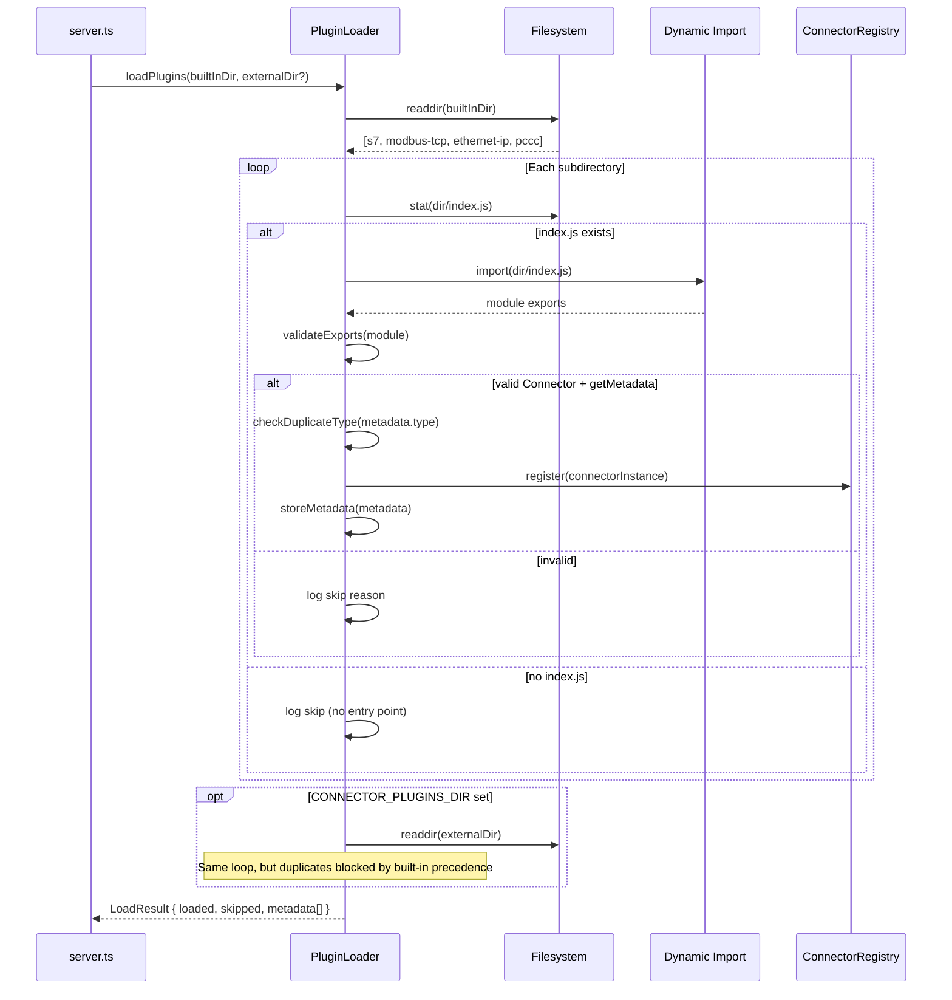

# Design Document: Connector Plugin Architecture

## Overview

This design replaces the hardcoded connector registration in `server.ts` with a plugin-based auto-discovery system. Instead of manually importing and instantiating each connector, a **Plugin Loader** module scans designated directories at startup, dynamically imports valid connector modules, extracts their metadata (including connection parameter schemas), and registers them with the `ConnectorRegistry`.

The key architectural change is inverting control: connectors no longer need to be known at compile time by the core system. A new connector is added by creating a directory with an `index.ts` that exports a class implementing `Connector` and a `getMetadata()` function — no changes to `server.ts`, `index.ts`, or route files required.

### Design Decisions

| Decision | Rationale |
|----------|-----------|
| Filesystem scanning over config file | Zero-config for new plugins — just drop a folder |
| `getMetadata()` static method over separate manifest | Keeps metadata co-located with the implementation, type-safe |
| Validate at load time, not at use time | Fail fast with clear logs on startup |
| Built-in plugins first, external second | Prevents external plugins from hijacking core protocol types |
| Schema-based validation over ad-hoc checks | Single validation engine for all protocols, consistent error messages |

## Architecture

### High-Level System Diagram

```mermaid
flowchart TB
    subgraph Startup
        SRV[server.ts] --> PL[PluginLoader]
        PL -->|scan| BD[src/connectors/*/]
        PL -->|scan| ED[CONNECTOR_PLUGINS_DIR/*/]
        PL -->|validate & import| PM[PluginManifest[]]
    end

    subgraph Runtime
        PM -->|register| CR[ConnectorRegistry]
        CR -->|protocols metadata| API[GET /api/connectors/protocols]
        API -->|JSON| FE[Frontend]
        FE -->|dynamic forms| CF[ConnectionForm]
        FE -->|protocol list| PS[ProtocolSelector]
    end

    subgraph Validation
        REQ[POST /connections] --> VL[ParamsValidator]
        VL -->|lookup schema| CR
        VL -->|validate| RESP[200 OK / 400 Error]
    end
```

### Plugin Loading Sequence



## Components and Interfaces

### New Module: `src/connectors/plugin-loader.ts`

```typescript
import { Connector, ConnectorType } from './types.js';

/** Result of the plugin loading process. */
export interface LoadResult {
  loaded: PluginInfo[];
  skipped: SkippedPlugin[];
}

export interface PluginInfo {
  type: ConnectorType;
  displayName: string;
  source: 'built-in' | 'external';
  connector: Connector;
  metadata: ConnectorMetadata;
}

export interface SkippedPlugin {
  directory: string;
  reason: string;
}

/**
 * Scan directories for connector plugins, validate exports,
 * instantiate connectors, and return load results.
 *
 * @param builtInDir - Path to built-in connectors (src/connectors/)
 * @param externalDir - Optional path from CONNECTOR_PLUGINS_DIR env var
 * @returns LoadResult with loaded plugins and skipped entries
 */
export async function loadPlugins(
  builtInDir: string,
  externalDir?: string
): Promise<LoadResult>;

/**
 * Validate that a dynamically imported module exports a valid connector.
 * Uses lightweight duck-typing: checks for getType() and getMetadata() methods.
 * TypeScript enforces the full Connector interface at compile time for built-in
 * plugins; this runtime check catches obvious issues with external plugins.
 */
export function validateConnectorModule(
  mod: Record<string, unknown>
): { valid: true; ConnectorClass: new () => Connector } | { valid: false; reason: string };
```

### New Interface: `ConnectorMetadata` (added to `src/connectors/types.ts`)

```typescript
/** Describes a single connection parameter field. */
export interface ParamFieldSchema {
  /** Internal field key (used in params Record). */
  key: string;
  /** Human-readable label for the form field. */
  label: string;
  /** Input type for rendering. */
  type: 'text' | 'number' | 'boolean' | 'select';
  /** Whether this field is required. */
  required: boolean;
  /** Default value (as string for form pre-fill). */
  defaultValue?: string | number | boolean;
  /** Placeholder text for text/number inputs. */
  placeholder?: string;
  /** Minimum value for number fields. */
  min?: number;
  /** Maximum value for number fields. */
  max?: number;
  /** Options for select fields. */
  options?: { value: string; label: string }[];
  /** Validation pattern (regex string) for text fields. */
  pattern?: string;
  /** Validation error message when pattern fails. */
  patternMessage?: string;
  /** Field description/help text. */
  description?: string;
}

/** Metadata descriptor for a connector plugin. */
export interface ConnectorMetadata {
  /** Protocol identifier string (e.g., 's7', 'modbus-tcp'). Must be unique. */
  type: ConnectorType;
  /** Human-readable display name (e.g., 'Siemens S7'). */
  displayName: string;
  /** Optional protocol description. */
  description?: string;
  /** Icon identifier or emoji for UI display. */
  icon?: string;
  /** Optional plugin version (e.g., '1.0.0'). Useful for debugging. */
  version?: string;
  /** Typed schema of connection parameters for dynamic form rendering. */
  paramsSchema: ParamFieldSchema[];
}

/**
 * Extended Connector interface for plugin-based connectors.
 * Adds metadata support to the base Connector interface.
 */
export interface ConnectorPlugin extends Connector {
  /** Returns the metadata descriptor for this connector's protocol. */
  getMetadata(): ConnectorMetadata;
}
```

### New Module: `src/connectors/params-validator.ts`

```typescript
import { ParamFieldSchema } from './types.js';

/** A single field validation error. */
export interface FieldError {
  field: string;
  message: string;
}

/** Validation result. */
export interface ValidationResult {
  valid: boolean;
  errors: FieldError[];
}

/**
 * Validate connection params against a paramsSchema.
 *
 * @param params - The params Record from the connection request
 * @param schema - The paramsSchema from the connector's metadata
 * @returns ValidationResult with per-field errors if invalid
 */
export function validateParams(
  params: Record<string, unknown>,
  schema: ParamFieldSchema[]
): ValidationResult;
```

### Updated: `ConnectorRegistry` (metadata awareness)

```typescript
// New methods added to ConnectorRegistry:

/** Get metadata for all registered connectors. */
getProtocolsMetadata(): ConnectorMetadata[];

/** Get metadata for a specific connector type. */
getProtocolMetadata(type: ConnectorType): ConnectorMetadata | undefined;

/** Get the paramsSchema for a connector type (for validation). */
getParamsSchema(type: ConnectorType): ParamFieldSchema[] | undefined;
```

### New Route: `GET /api/connectors/protocols`

Added to the existing `src/api/routes/connectors.ts` router:

```typescript
/** GET /api/connectors/protocols - List all available protocols with metadata */
router.get('/protocols', (_req: Request, res: Response) => {
  const protocols = registry?.getProtocolsMetadata() ?? [];
  res.json(protocols);
});
```

This endpoint is placed before authenticated routes (no auth middleware).

### Updated: `server.ts` Startup

```typescript
// Before (hardcoded):
const s7Connector = new S7Connector();
const modbusConnector = new ModbusConnector();
// ... manual registration

// After (dynamic):
const { loaded, skipped } = await loadPlugins(
  path.join(__dirname, '../connectors'),
  process.env.CONNECTOR_PLUGINS_DIR
);

for (const plugin of loaded) {
  connectorRegistry.register(plugin.connector, plugin.metadata);
}

logService.info('Server', `Loaded ${loaded.length} connector plugin(s), skipped ${skipped.length}`);
for (const skip of skipped) {
  logService.warn('Server', `Skipped plugin "${skip.directory}": ${skip.reason}`);
}
```

### Connector Plugin Contract (what each existing connector must add)

Each connector adds a static `getMetadata()` method. Example for S7:

```typescript
export class S7Connector implements ConnectorPlugin {
  // ... existing implementation unchanged ...

  getMetadata(): ConnectorMetadata {
    return {
      type: 's7',
      displayName: 'Siemens S7',
      description: 'Connect to S7-300/400/1200/1500 PLCs via ISO-on-TCP',
      icon: '🔌',
      paramsSchema: [
        { key: 'host', label: 'Host', type: 'text', required: true, placeholder: '192.168.1.10' },
        { key: 'rack', label: 'Rack', type: 'number', required: false, defaultValue: 0, min: 0 },
        { key: 'slot', label: 'Slot', type: 'number', required: false, defaultValue: 1, min: 0 },
      ],
    };
  }
}
```

## Data Models

### ConnectorMetadata (API Response Shape)

```json
{
  "type": "s7",
  "displayName": "Siemens S7",
  "description": "Connect to S7-300/400/1200/1500 PLCs via ISO-on-TCP",
  "icon": "🔌",
  "paramsSchema": [
    {
      "key": "host",
      "label": "Host",
      "type": "text",
      "required": true,
      "placeholder": "192.168.1.10"
    },
    {
      "key": "rack",
      "label": "Rack",
      "type": "number",
      "required": false,
      "defaultValue": 0,
      "min": 0
    },
    {
      "key": "slot",
      "label": "Slot",
      "type": "number",
      "required": false,
      "defaultValue": 1,
      "min": 0
    }
  ]
}
```

### GET /api/connectors/protocols Response

```json
[
  { "type": "s7", "displayName": "Siemens S7", "description": "...", "icon": "🔌", "paramsSchema": [...] },
  { "type": "modbus-tcp", "displayName": "Modbus TCP", "description": "...", "icon": "📡", "paramsSchema": [...] },
  { "type": "ethernet-ip", "displayName": "EtherNet/IP", "description": "...", "icon": "🏭", "paramsSchema": [...] },
  { "type": "pccc", "displayName": "PCCC", "description": "...", "icon": "🔧", "paramsSchema": [...] }
]
```

### Validation Error Response (400)

```json
{
  "error": {
    "code": "VALIDATION_ERROR",
    "message": "Invalid connection parameters",
    "details": [
      { "field": "host", "message": "Host is required" },
      { "field": "port", "message": "Port must be between 1 and 65535" }
    ]
  }
}
```

### Internal: LoadResult

```typescript
{
  loaded: [
    { type: 's7', displayName: 'Siemens S7', source: 'built-in', connector: <instance>, metadata: <ConnectorMetadata> },
    // ...
  ],
  skipped: [
    { directory: 'some-broken-plugin', reason: 'Module does not export a Connector class' },
  ]
}
```

## Correctness Properties

*A property is a characteristic or behavior that should hold true across all valid executions of a system — essentially, a formal statement about what the system should do. Properties serve as the bridge between human-readable specifications and machine-verifiable correctness guarantees.*

### Property 1: Plugin discovery correctly classifies directories

*For any* set of directories where some contain valid Connector exports (with `getMetadata()`) and some do not, the plugin loader SHALL return exactly the valid directories in `loaded` and all invalid directories in `skipped` — with no crashes regardless of directory contents.

**Validates: Requirements 1.1, 1.2, 2.1, 2.2, 2.3, 7.1, 7.2**

### Property 2: Protocols endpoint returns complete metadata for all registered connectors

*For any* set of registered connectors with metadata, calling `GET /api/connectors/protocols` SHALL return an array containing one entry per registered connector, where each entry includes `type`, `displayName`, and a non-empty `paramsSchema` array.

**Validates: Requirements 4.1, 4.2**

### Property 3: First-registered type wins on duplicate

*For any* set of connector plugins where two or more share the same `type` identifier, the plugin loader SHALL register only the first one encountered and skip subsequent duplicates.

**Validates: Requirements 7.3**

### Property 4: Built-in plugins take precedence over external

*For any* type collision between a built-in plugin and an external plugin, the built-in connector SHALL be the one registered, regardless of directory ordering within the external directory.

**Validates: Requirements 8.3**

### Property 5: Params validation against paramsSchema

*For any* `paramsSchema` and `params` object, the validator SHALL:
- Accept params where all required fields are present with correct types
- Reject params where required fields are missing or have incorrect types
- Return structured per-field error messages for each invalid field

**Validates: Requirements 9.1, 9.2**

### Property 6: Dynamic form renders all schema fields

*For any* `paramsSchema` array, the `ConnectionForm` component SHALL render one labeled input element for each field in the schema, with the correct input type (`text`, `number`, `select`).

**Validates: Requirements 5.2**

## Error Handling

| Scenario | Behavior |
|----------|----------|
| Directory without `index.js`/`index.ts` | Skip, log reason "no entry point found" |
| Module throws on import (syntax error) | Catch, skip, log "failed to import: {error}" |
| Module exports no valid Connector class | Skip, log "no valid Connector export found" |
| Module has Connector but no `getMetadata()` | Skip, log "missing getMetadata method" |
| `getMetadata()` returns invalid shape | Skip, log "invalid metadata: {details}" |
| Duplicate type identifier | Skip duplicate, log warning "type '{type}' already registered by {first}" |
| `CONNECTOR_PLUGINS_DIR` path doesn't exist | Log warning, continue with built-in plugins only |
| `CONNECTOR_PLUGINS_DIR` is not readable | Log warning, continue with built-in plugins only |
| Validation fails on connection create/update | Return 400 with structured `{ error: { code, message, details[] } }` |
| Unknown protocol type on create (no schema available) | Skip validation, allow through (backward compatible) |

All errors during plugin loading are non-fatal — the system starts with whatever plugins loaded successfully. This ensures a single broken plugin cannot prevent the entire system from starting.

## Testing Strategy

### Unit Tests

- **`params-validator.test.ts`**: Test validation logic with specific examples for each field type (text, number, boolean, select), required vs optional, min/max bounds, pattern matching.
- **`plugin-loader.test.ts`**: Test with mock filesystem/modules — valid plugins, invalid exports, missing files, duplicate types.
- **`connector-registry.test.ts`**: Test new `getProtocolsMetadata()` method with various registered connectors.
- **Route test**: Verify `GET /api/connectors/protocols` returns correct response shape.

### Property-Based Tests (fast-check)

Property-based testing is appropriate here because:
- The params validator is a pure function with clear input/output behavior
- The plugin loader has universal classification properties (valid/invalid)
- The input space is large (arbitrary params, schemas, directory structures)

**Library**: fast-check 3 (already in the project)
**Configuration**: Minimum 100 iterations per property test

Each property test references its design document property:

```typescript
// Feature: connector-plugin-architecture, Property 1: Plugin discovery correctly classifies directories
// Feature: connector-plugin-architecture, Property 3: First-registered type wins on duplicate
// Feature: connector-plugin-architecture, Property 4: Built-in plugins take precedence over external
// Feature: connector-plugin-architecture, Property 5: Params validation against paramsSchema
```

### Component Tests

- **`ProtocolSelector.test.tsx`**: Mock API, verify dynamic rendering from fetched data.
- **`ConnectionForm.test.tsx`**: Test with various `paramsSchema` inputs, verify field rendering and fallback.

### Integration Tests

- **Full startup test**: Verify the server starts and all 4 built-in connectors are loaded via plugin discovery.
- **Regression**: Existing connector CRUD tests continue to pass without modification.

### Test Organization

```
tests/
├── unit/
│   ├── params-validator.test.ts
│   ├── plugin-loader.test.ts
│   └── connectors-protocols-route.test.ts
├── property/
│   ├── params-validator.property.test.ts
│   └── plugin-loader.property.test.ts
├── integration/
│   └── plugin-discovery.test.ts
└── components/
    ├── ProtocolSelector.test.tsx
    └── ConnectionForm.test.tsx
```
