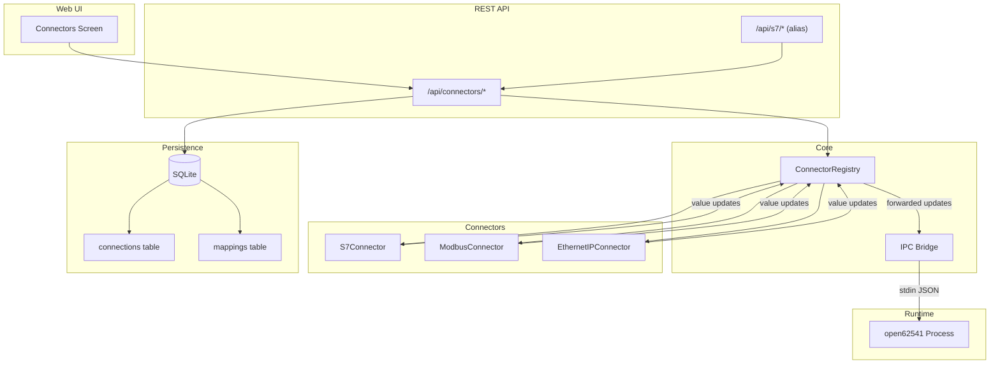

# Design Document: Multi-Protocol Connectors

## Overview

This design transforms the OPC UA Light Server from a single-protocol (S7) architecture into a pluggable multi-protocol connector system. The refactor introduces a shared `Connector` interface, a `ConnectorRegistry` for lifecycle management, a generalized database schema, a unified REST API, and a protocol-agnostic Web UI — while maintaining full backward compatibility with existing S7 API consumers.

The design follows the existing project patterns: Result<T> for error handling, repository-per-entity data access, Express router modules, React Query-backed UI screens, and fast-check property-based testing.

### Key Design Decisions

1. **Protocol-specific params stored as JSON** — The `connections` table uses a `params TEXT` column to hold protocol-specific configuration (host, rack, slot for S7; host, port, unitId for Modbus). This avoids schema changes when adding protocols.
2. **Connector interface is event-driven** — Connectors emit batched value updates via callback rather than return values synchronously, matching the existing S7Connector's design.
3. **Registry aggregates, connectors own state** — The ConnectorRegistry delegates all connection/polling management to individual connectors, only handling registration, lifecycle orchestration, and value forwarding.
4. **Backward-compatible S7 alias routes** — A thin translation layer maps legacy `/api/s7/*` requests to the new `/api/connectors/*` handlers, preserving the existing response shape.
5. **Migration preserves data** — Existing `s7_connections` and `s7_mappings` data is migrated in-place to the new generalized tables, then the old tables are dropped.

## Architecture



### Data Flow

1. **Startup**: API server reads `connections` and `mappings` from SQLite → instantiates connectors via registry → calls `registry.startAll()`
2. **Polling**: Each connector polls its connected devices at the configured interval → emits `ValueUpdate[]` via callback
3. **Value forwarding**: Registry receives updates → forwards to IPC Bridge → Bridge resolves UUID→OPC UA node ID → writes JSON to runtime stdin
4. **API mutations**: REST endpoint updates DB → notifies the relevant connector of config change → connector reconnects/re-polls as needed

## Components and Interfaces

### Connector Interface (`src/connectors/types.ts`)

```typescript
/** Protocol type discriminator string. */
export type ConnectorType = 's7' | 'modbus-tcp' | 'ethernet-ip' | string;

/** Protocol-agnostic connection configuration. */
export interface ConnectionConfig {
  id: string;
  type: ConnectorType;
  name: string;
  params: Record<string, unknown>;
  pollingIntervalMs: number;
  reconnectIntervalMs: number;
  enabled: boolean;
  createdAt: string;
}

/** Protocol-agnostic mapping between a device address and an OPC UA node. */
export interface Mapping {
  id: string;
  connectionId: string;
  nodeId: string;
  deviceAddress: string;
  description?: string;
  createdAt: string;
}

/** Value update emitted by connectors after a poll cycle. */
export interface ValueUpdate {
  nodeId: string;
  value: unknown;
  quality: 'good' | 'bad';
  timestamp: Date;
}

/** Connection status report. */
export interface ConnectionStatus {
  connectionId: string;
  state: 'connected' | 'disconnected' | 'error';
  lastPollAt?: string;
  errorMessage?: string;
}

/** Current value snapshot for a mapped variable. */
export interface CurrentValue {
  nodeId: string;
  deviceAddress: string;
  connectionId: string;
  value: unknown;
  quality: 'good' | 'bad';
  timestamp: string;
}

/** Callback type for value update notifications. */
export type ValueUpdateCallback = (updates: ValueUpdate[]) => void;

/**
 * The interface all protocol connectors must implement.
 * Each connector manages one or more connections of the same protocol type.
 */
export interface Connector {
  /** Returns the protocol type identifier (e.g., "s7", "modbus-tcp"). */
  getType(): ConnectorType;

  /** Start all enabled connections and begin polling. */
  start(): void;

  /** Stop all connections and release resources. */
  stop(): void;

  /** Register a new connection configuration. */
  addConnection(config: ConnectionConfig): void;

  /** Remove a connection and clean up associated resources. */
  removeConnection(id: string): void;

  /** Apply configuration changes to an existing connection. */
  updateConnection(config: ConnectionConfig): void;

  /** Associate a device address with an OPC UA node. */
  addMapping(mapping: Mapping): void;

  /** Remove an address-to-node association. */
  removeMapping(id: string): void;

  /** Get connection status for all managed connections. */
  getStatus(): ConnectionStatus[];

  /** Get the last-read value for all mapped variables. */
  getCurrentValues(): CurrentValue[];

  /** Register callback for batched value updates after each poll cycle. */
  onValueUpdate(callback: ValueUpdateCallback): void;
}
```

### Connector Registry (`src/connectors/connector-registry.ts`)

```typescript
export class ConnectorRegistry {
  private connectors: Map<ConnectorType, Connector> = new Map();
  private valueUpdateCallback: ValueUpdateCallback | null = null;

  /** Register a connector instance by its type. */
  register(connector: Connector): void;

  /** Start all registered connectors. */
  startAll(): void;

  /** Stop all registered connectors. */
  stopAll(): void;

  /** Get a connector by type. Returns undefined if not registered. */
  getConnector(type: ConnectorType): Connector | undefined;

  /** Aggregated status across all connectors. */
  getAggregatedStatus(): ConnectionStatus[];

  /** Aggregated current values from all connectors. */
  getAggregatedValues(): CurrentValue[];

  /** Register a single callback to receive forwarded value updates from all connectors. */
  onValueUpdate(callback: ValueUpdateCallback): void;
}
```

When a connector is registered, the registry subscribes to its `onValueUpdate` and forwards updates to the single registered callback (the IPC Bridge).

### Connector Repository (`src/db/repositories/connector-repository.ts`)

Replaces `S7Repository`. Operates on the generalized `connections` and `mappings` tables.

```typescript
export class ConnectorRepository {
  constructor(private database: Database) {}

  // ─── Connection CRUD ────────────────────────────────────────────
  createConnection(request: CreateConnectionRequest): Result<ConnectionConfig>;
  findAllConnections(type?: ConnectorType): ConnectionConfig[];
  findConnectionById(id: string): ConnectionConfig | null;
  updateConnection(id: string, request: UpdateConnectionRequest): Result<ConnectionConfig>;
  deleteConnection(id: string): Result<void>;

  // ─── Mapping CRUD ───────────────────────────────────────────────
  createMapping(request: CreateMappingRequest): Result<Mapping>;
  findAllMappings(connectionId?: string): Mapping[];
  findMappingById(id: string): Mapping | null;
  updateMapping(id: string, request: UpdateMappingRequest): Result<Mapping>;
  deleteMapping(id: string): Result<void>;
  createMappingsBulk(requests: CreateMappingRequest[]): BulkResult<Mapping>;
}
```

### S7 Connector (`src/connectors/s7/index.ts`)

Refactored from the existing `S7Connector` class to implement the `Connector` interface. Internally it continues to use the `nodes7` library with the same reconnection and polling logic.

**Key change**: Instead of receiving `S7ConnectionConfig` directly, it receives `ConnectionConfig` and extracts `host`, `rack`, `slot` from `config.params`.

```typescript
export class S7Connector implements Connector {
  getType(): ConnectorType { return 's7'; }

  // Parses params: { host: string, rack: number, slot: number }
  addConnection(config: ConnectionConfig): void { /* ... */ }

  // All other Connector methods adapted from existing implementation
}
```

### Modbus TCP Connector (`src/connectors/modbus-tcp/index.ts`)

```typescript
import ModbusRTU from 'modbus-serial';

export class ModbusConnector implements Connector {
  getType(): ConnectorType { return 'modbus-tcp'; }

  // Parses params: { host: string, port: number, unitId: number }
  // Device address format: "HR:address:count", "IR:address:count", "CO:address", "DI:address"
}
```

### EtherNet/IP Connector (`src/connectors/ethernet-ip/index.ts`)

```typescript
import { Controller } from 'ethernet-ip';

export class EthernetIPConnector implements Connector {
  getType(): ConnectorType { return 'ethernet-ip'; }

  // Parses params: { host: string, port: number, slot: number }
  // Device address is a CIP tag name string
}
```

### Unified API Routes (`src/api/routes/connectors.ts`)

A single Express router handles all `/api/connectors/*` endpoints:

| Method | Path | Description |
|--------|------|-------------|
| POST | /connections | Create connection (any type) |
| GET | /connections | List connections (optional `?type=` filter) |
| PUT | /connections/:id | Update connection |
| DELETE | /connections/:id | Delete connection (cascades mappings) |
| POST | /mappings | Create mapping |
| GET | /mappings | List mappings (optional `?connectionId=` filter) |
| PUT | /mappings/:id | Update mapping |
| DELETE | /mappings/:id | Delete mapping |
| POST | /mappings/bulk | Bulk create with per-item reporting |
| GET | /mappings/export/csv | Export all mappings as CSV |
| POST | /mappings/import/csv | Import mappings from CSV |
| GET | /status | Aggregated status from registry |
| GET | /values | Live values from registry |

### S7 Alias Routes (`src/api/routes/s7-alias.ts`)

Thin wrapper that translates between the legacy S7 body format (flat `host`, `rack`, `slot`) and the generalized format (`type: "s7"`, `params: { host, rack, slot }`), then delegates to the connectors router logic.

### IPC Bridge (`src/connectors/ipc-bridge.ts`)

Generalized from `S7IpcBridge`. Instead of receiving updates directly from an S7Connector, it registers as the value update callback on the `ConnectorRegistry`.

```typescript
export class IpcBridge {
  private uuidToOpcUaId: Map<string, string> | null = null;

  constructor(
    private configGenerator: ConfigGenerator,
    private processManager: ProcessManager,
    private database: Database,
  ) {}

  /** Called by the registry when any connector emits value updates. */
  handleValueUpdates(updates: ValueUpdate[]): void;

  /** Invalidate the UUID→nodeId map on address space changes. */
  invalidateMap(): void;
}
```

### Config Generator Updates

The `ConfigGenerator.loadS7Mappings()` method is replaced with `loadMappings()` which queries the generalized `mappings` table joined with `connections`. The `s7Mapping` field in `NodeConfig` is replaced with a generic `connectorMapping` field containing `{ connectionType, connectionHost, deviceAddress }`.

### Web UI Connectors Screen (`web/src/screens/connectors/`)

| Component | Responsibility |
|-----------|---------------|
| `ConnectorsManager.tsx` | Top-level screen with protocol filter tabs |
| `ConnectionCard.tsx` | Displays a single connection with status badge |
| `ConnectionForm.tsx` | Protocol-aware form (dynamic fields based on type) |
| `MappingTable.tsx` | Mapping list per connection with live values |
| `ProtocolSelector.tsx` | Protocol type picker for new connection flow |

## Data Models

### Database Schema (Migration v4)

```sql
-- Generalized connections table
CREATE TABLE IF NOT EXISTS connections (
    id TEXT PRIMARY KEY,
    type TEXT NOT NULL,
    name TEXT NOT NULL,
    params TEXT NOT NULL,          -- JSON object with protocol-specific fields
    polling_interval_ms INTEGER NOT NULL DEFAULT 1000,
    reconnect_interval_ms INTEGER NOT NULL DEFAULT 5000,
    enabled INTEGER NOT NULL DEFAULT 1,
    created_at TEXT NOT NULL DEFAULT (datetime('now'))
);

-- Generalized mappings table
CREATE TABLE IF NOT EXISTS mappings (
    id TEXT PRIMARY KEY,
    connection_id TEXT NOT NULL REFERENCES connections(id) ON DELETE CASCADE,
    node_id TEXT NOT NULL REFERENCES nodes(id) ON DELETE CASCADE,
    device_address TEXT NOT NULL,
    description TEXT,
    created_at TEXT NOT NULL DEFAULT (datetime('now')),
    UNIQUE(connection_id, device_address),
    UNIQUE(node_id)
);
```

### Migration Strategy (v3 → v4)

```sql
-- Step 1: Create new tables
CREATE TABLE connections (...);
CREATE TABLE mappings (...);

-- Step 2: Migrate S7 data
INSERT INTO connections (id, type, name, params, polling_interval_ms, reconnect_interval_ms, enabled, created_at)
  SELECT id, 's7', name, json_object('host', host, 'rack', rack, 'slot', slot),
         polling_interval_ms, reconnect_interval_ms, enabled, created_at
  FROM s7_connections;

INSERT INTO mappings (id, connection_id, node_id, device_address, description, created_at)
  SELECT id, connection_id, node_id, plc_address, description, created_at
  FROM s7_mappings;

-- Step 3: Drop old tables
DROP TABLE s7_mappings;
DROP TABLE s7_connections;

-- Step 4: Record migration
INSERT INTO schema_migrations (version) VALUES (4);
```

### Protocol-Specific Params Schemas

**S7** (`type: "s7"`):
```json
{ "host": "192.168.1.10", "rack": 0, "slot": 1 }
```

**Modbus TCP** (`type: "modbus-tcp"`):
```json
{ "host": "192.168.1.20", "port": 502, "unitId": 1 }
```

**EtherNet/IP** (`type: "ethernet-ip"`):
```json
{ "host": "192.168.1.30", "port": 44818, "slot": 0 }
```

### Device Address Formats

| Protocol | Format | Examples |
|----------|--------|----------|
| S7 | nodes7 address syntax | `DB1,REAL0`, `DB5,INT10.1` |
| Modbus TCP | `{type}:{address}:{count?}` | `HR:100:2`, `IR:0:1`, `CO:0`, `DI:8` |
| EtherNet/IP | CIP tag name | `Motor1_Speed`, `Tank.Level` |

