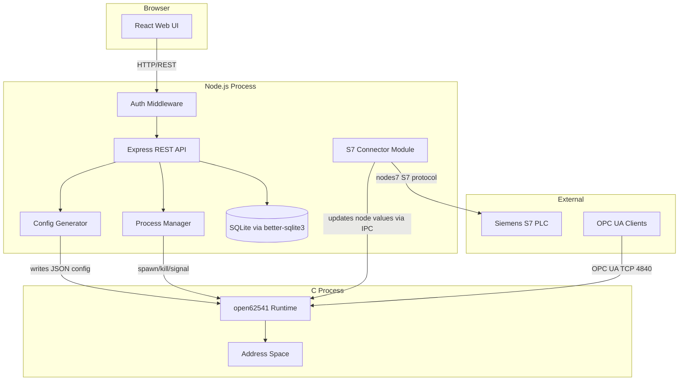

# Design Document: OPC UA Light Server

## Overview

OPC UA Light Server is a three-tier system that combines a high-performance OPC UA runtime (open62541 in C), a Node.js control plane (REST API + SQLite), and a React web UI. The architecture separates concerns cleanly: the C runtime handles OPC UA protocol compliance and real-time data serving, Node.js handles configuration management and process orchestration, and React provides the operator interface.

**Key Design Decisions:**

1. **open62541 as a standalone process** — The C runtime runs as a separate OS process managed by Node.js via `child_process.spawn()`. This provides process isolation (a crash in the runtime doesn't take down the API), independent resource management, and the ability to restart/reload the runtime without API downtime.

2. **JSON configuration file as the IPC contract** — Rather than embedding open62541 as a native addon, the Control API generates a JSON configuration file that the runtime reads at startup and on reload (via SIGUSR1/named pipe). This keeps the boundary simple and testable.

3. **better-sqlite3 for persistence** — Synchronous API eliminates callback complexity for what is fundamentally a single-writer workload. High performance for the expected data volumes (hundreds to low thousands of nodes).

4. **nodes7 for S7 connectivity** — Pure JavaScript S7 protocol implementation that runs in the Node.js process, polling PLC data and writing values to the runtime via a shared-memory or IPC mechanism.

## Architecture



### Communication Patterns

| Path | Mechanism | Direction |
|------|-----------|-----------|
| Web UI ↔ Control API | HTTP REST (JSON) | Bidirectional |
| Control API → Runtime | Process spawn, SIGUSR1 signal (Linux) or named pipe (Windows) | One-way command |
| Control API → Runtime (config) | JSON file on disk | One-way data |
| S7 Connector → Runtime | Shared memory or stdin pipe for value updates | One-way data |
| OPC UA Clients → Runtime | OPC UA Binary over TCP (port 4840) | Bidirectional |
| S7 Connector → PLC | S7 ISO-on-TCP (port 102) | Bidirectional |

## Components and Interfaces

### 1. Control API (Node.js / Express)

**Responsibilities:** REST endpoint handling, request validation, authentication, orchestration of all subsystems.

```typescript
// Core route structure
POST   /api/nodes              // Create node
GET    /api/nodes              // List nodes
GET    /api/nodes/:id          // Get node
PUT    /api/nodes/:id          // Update node
DELETE /api/nodes/:id          // Delete node

POST   /api/namespaces         // Create namespace
GET    /api/namespaces         // List namespaces
PUT    /api/namespaces/:id     // Update namespace
DELETE /api/namespaces/:id     // Delete namespace (cascade)

POST   /api/folders            // Create folder
GET    /api/namespaces/:id/folders  // Get folder tree
DELETE /api/folders/:id        // Delete folder (reassign nodes)

POST   /api/server/start       // Start runtime
POST   /api/server/stop        // Stop runtime
POST   /api/server/reload      // Reload address space
GET    /api/server/status      // Get status (unauthenticated)

GET    /api/security           // Get security config
PUT    /api/security/policy    // Set security mode
POST   /api/security/certificate  // Upload certificate

POST   /api/s7/connections     // Create S7 connection
GET    /api/s7/connections     // List S7 connections
DELETE /api/s7/connections/:id // Delete S7 connection
POST   /api/s7/mappings        // Create PLC-to-node mapping
GET    /api/s7/mappings        // List mappings
DELETE /api/s7/mappings/:id    // Delete mapping
GET    /api/s7/status          // Get connection statuses
```

### 2. Process Manager

**Responsibilities:** Lifecycle management of the open62541 runtime process.

```typescript
interface ProcessManager {
  start(): Promise<StartResult>;
  stop(): Promise<void>;
  reload(): Promise<void>;
  getStatus(): ServerStatus;
  onCrash(handler: (reason: string) => void): void;
}

interface ServerStatus {
  state: 'running' | 'stopped' | 'error';
  uptime?: number;        // seconds since start
  pid?: number;
  connectedClients?: number;
  lastError?: string;
}

interface StartResult {
  pid: number;
  startedAt: Date;
}
```

**Implementation:** Uses `child_process.spawn()` to launch the compiled open62541 executable. Monitors the process via `exit` and `error` events. Sends reload signals via OS signals (SIGUSR1 on Linux) or a control pipe (Windows).

### 3. Config Generator

**Responsibilities:** Reads the current state from SQLite and produces the JSON configuration file consumed by the runtime.

```typescript
interface ConfigGenerator {
  generate(): AddressSpaceConfig;
  writeToFile(path: string): void;
}

interface AddressSpaceConfig {
  version: number;
  generatedAt: string;
  security: SecurityConfig;
  namespaces: NamespaceConfig[];
}

interface NamespaceConfig {
  name: string;
  uri: string;
  folders: FolderConfig[];
  nodes: NodeConfig[];
}

interface FolderConfig {
  name: string;
  path: string;          // e.g., "Devices/PLC1/Temperatures"
  children: FolderConfig[];
}

interface NodeConfig {
  name: string;
  nodeId: string;        // e.g., "ns=2;s=Temperature.Sensor1"
  dataType: OpcUaDataType;
  folderPath: string;
  initialValue?: unknown;
  s7Mapping?: S7MappingConfig;
}
```

### 4. OPC UA Runtime (C / open62541)

**Responsibilities:** Hosts the OPC UA server, builds the address space from the JSON config, handles OPC UA client connections, and responds to reload signals.

```c
// Pseudocode for runtime main loop
int main(int argc, char *argv[]) {
    // 1. Parse config file path from argv
    // 2. Load and parse JSON configuration
    // 3. Initialize UA_Server with security settings
    // 4. Build address space from config (namespaces, folders, nodes)
    // 5. Register signal handler for SIGUSR1 (reload)
    // 6. Run server loop
    // On SIGUSR1: re-read config file, rebuild address space
}
```

**Key open62541 APIs used:**
- `UA_Server_addNamespace()` — Register custom namespaces
- `UA_Server_addObjectNode()` — Create folder objects
- `UA_Server_addVariableNode()` — Create variable nodes
- `UA_Server_writeValue()` — Update node values (from S7 connector)
- `UA_Server_run()` — Main server loop

### 5. S7 Connector Module

**Responsibilities:** Manages connections to Siemens S7 PLCs, polls mapped variables, and updates OPC UA node values.

```typescript
interface S7Connector {
  addConnection(config: S7ConnectionConfig): void;
  removeConnection(id: string): void;
  addMapping(mapping: S7Mapping): void;
  removeMapping(id: string): void;
  getStatus(): S7ConnectionStatus[];
  start(): void;
  stop(): void;
}

interface S7ConnectionConfig {
  id: string;
  host: string;
  rack: number;
  slot: number;
  pollingIntervalMs: number;
  reconnectIntervalMs: number;
}

interface S7Mapping {
  id: string;
  connectionId: string;
  plcAddress: string;    // e.g., "DB1,REAL0" (DB number, type, offset)
  nodeId: string;        // Target OPC UA node ID
  dataType: string;
}

interface S7ConnectionStatus {
  connectionId: string;
  state: 'connected' | 'disconnected' | 'error';
  lastPollAt?: Date;
  errorMessage?: string;
}
```

### 6. Authentication Middleware

**Responsibilities:** Validates API keys or JWT tokens on mutating endpoints.

```typescript
interface AuthConfig {
  mode: 'api-key' | 'jwt';
  apiKeys?: string[];          // For api-key mode
  jwtSecret?: string;          // For jwt mode
  jwtIssuer?: string;
}

// Middleware behavior:
// - GET /api/server/status → bypass auth (health monitoring)
// - All POST/PUT/DELETE → require valid credentials
// - Invalid/missing → 401 with descriptive error
```

### 7. Web UI (React)

**Responsibilities:** Provides the operator interface for managing the OPC UA server.

**Key Components:**
- `Dashboard` — Server status, start/stop/reload controls, uptime, client count
- `AddressSpaceTree` — Navigable tree of namespaces → folders → nodes
- `NodeDetailPanel` — View/edit node properties
- `NodeForm` — Create/edit node with validation
- `NamespaceManager` — CRUD for namespaces
- `SecuritySettings` — Security mode selection, certificate upload
- `S7ConnectionManager` — S7 connection and mapping configuration

**State Management:** React Query for server state synchronization with 5-second polling for status updates.

## Data Models

### SQLite Schema

```sql
-- Schema version tracking
CREATE TABLE schema_migrations (
    version INTEGER PRIMARY KEY,
    applied_at TEXT NOT NULL DEFAULT (datetime('now'))
);

-- Namespaces
CREATE TABLE namespaces (
    id TEXT PRIMARY KEY,           -- UUID
    name TEXT NOT NULL UNIQUE,
    description TEXT,
    uri TEXT NOT NULL UNIQUE,      -- OPC UA namespace URI
    created_at TEXT NOT NULL DEFAULT (datetime('now')),
    updated_at TEXT NOT NULL DEFAULT (datetime('now'))
);

-- Folders (self-referencing for hierarchy)
CREATE TABLE folders (
    id TEXT PRIMARY KEY,           -- UUID
    namespace_id TEXT NOT NULL REFERENCES namespaces(id) ON DELETE CASCADE,
    parent_folder_id TEXT REFERENCES folders(id) ON DELETE SET NULL,
    name TEXT NOT NULL,
    created_at TEXT NOT NULL DEFAULT (datetime('now')),
    UNIQUE(namespace_id, parent_folder_id, name)
);

-- Nodes (OPC UA variable nodes)
CREATE TABLE nodes (
    id TEXT PRIMARY KEY,           -- UUID
    namespace_id TEXT NOT NULL REFERENCES namespaces(id) ON DELETE CASCADE,
    folder_id TEXT REFERENCES folders(id) ON DELETE SET NULL,
    name TEXT NOT NULL,
    data_type TEXT NOT NULL,       -- Boolean, Int32, Float, Double, String, etc.
    initial_value TEXT,            -- JSON-encoded initial value
    description TEXT,
    created_at TEXT NOT NULL DEFAULT (datetime('now')),
    updated_at TEXT NOT NULL DEFAULT (datetime('now')),
    UNIQUE(namespace_id, name)
);

-- Security configuration (single row)
CREATE TABLE security_config (
    id INTEGER PRIMARY KEY CHECK (id = 1),
    mode TEXT NOT NULL DEFAULT 'None',  -- None, Sign, SignAndEncrypt
    certificate_path TEXT,
    private_key_path TEXT,
    updated_at TEXT NOT NULL DEFAULT (datetime('now'))
);

-- S7 PLC connections
CREATE TABLE s7_connections (
    id TEXT PRIMARY KEY,           -- UUID
    name TEXT NOT NULL,
    host TEXT NOT NULL,
    rack INTEGER NOT NULL DEFAULT 0,
    slot INTEGER NOT NULL DEFAULT 1,
    polling_interval_ms INTEGER NOT NULL DEFAULT 1000,
    reconnect_interval_ms INTEGER NOT NULL DEFAULT 5000,
    enabled INTEGER NOT NULL DEFAULT 1,
    created_at TEXT NOT NULL DEFAULT (datetime('now'))
);

-- S7 variable-to-node mappings
CREATE TABLE s7_mappings (
    id TEXT PRIMARY KEY,           -- UUID
    connection_id TEXT NOT NULL REFERENCES s7_connections(id) ON DELETE CASCADE,
    node_id TEXT NOT NULL REFERENCES nodes(id) ON DELETE CASCADE,
    plc_address TEXT NOT NULL,     -- e.g., "DB1,REAL0"
    created_at TEXT NOT NULL DEFAULT (datetime('now')),
    UNIQUE(connection_id, plc_address),
    UNIQUE(node_id)               -- One node can only have one S7 source
);
```

### TypeScript Domain Types

```typescript
type OpcUaDataType = 
  | 'Boolean' | 'Int16' | 'Int32' | 'Int64'
  | 'UInt16' | 'UInt32' | 'UInt64'
  | 'Float' | 'Double' | 'String' | 'DateTime' | 'ByteString';

interface OpcUaNode {
  id: string;
  namespaceId: string;
  folderId: string | null;
  name: string;
  dataType: OpcUaDataType;
  initialValue?: unknown;
  description?: string;
  createdAt: string;
  updatedAt: string;
}

interface Namespace {
  id: string;
  name: string;
  description?: string;
  uri: string;
  nodeCount?: number;
  createdAt: string;
  updatedAt: string;
}

interface Folder {
  id: string;
  namespaceId: string;
  parentFolderId: string | null;
  name: string;
  children?: Folder[];
  createdAt: string;
}

interface SecurityConfig {
  mode: 'None' | 'Sign' | 'SignAndEncrypt';
  certificatePath?: string;
  certificateValid?: boolean;
  privateKeyConfigured: boolean;  // Never expose actual key
}
```

### JSON Configuration File Format (Runtime Contract)

```json
{
  "version": 1,
  "generatedAt": "2024-01-15T10:30:00Z",
  "security": {
    "mode": "SignAndEncrypt",
    "certificatePath": "/config/certs/server.der",
    "privateKeyPath": "/config/certs/server.key"
  },
  "namespaces": [
    {
      "name": "PlantFloor",
      "uri": "urn:opcua-light:PlantFloor",
      "folders": [
        {
          "name": "Temperatures",
          "path": "PlantFloor/Temperatures",
          "children": []
        }
      ],
      "nodes": [
        {
          "name": "Sensor1",
          "nodeId": "ns=2;s=PlantFloor.Temperatures.Sensor1",
          "dataType": "Double",
          "folderPath": "PlantFloor/Temperatures",
          "initialValue": 0.0
        }
      ]
    }
  ]
}
```

## Correctness Properties

*A property is a characteristic or behavior that should hold true across all valid executions of a system — essentially, a formal statement about what the system should do. Properties serve as the bridge between human-readable specifications and machine-verifiable correctness guarantees.*

### Property 1: Entity Persistence Round-Trip

*For any* valid entity (node, namespace, folder, S7 connection, or S7 mapping), creating it via the Control API and then retrieving it SHALL produce an entity with identical field values (excluding server-generated timestamps and IDs).

**Validates: Requirements 1.1, 1.2, 1.3, 2.1, 2.2, 2.3, 3.1, 7.1, 7.2, 10.1**

### Property 2: Cascade Deletion Leaves No Orphans

*For any* namespace containing an arbitrary number of folders and nodes, deleting the namespace SHALL result in zero folders and zero nodes referencing that namespace remaining in the store.

**Validates: Requirements 2.4**

### Property 3: Folder Tree Structure Correctness

*For any* set of folders with parent-child relationships within a namespace, the folder tree endpoint SHALL return a tree where every folder appears exactly once and each folder's children match the declared parent relationships.

**Validates: Requirements 3.2**

### Property 4: Folder Deletion Reassigns Nodes to Parent

*For any* folder containing nodes, deleting that folder SHALL result in all previously-contained nodes being reassigned to the folder's parent (or namespace root if no parent), with no nodes lost.

**Validates: Requirements 3.3**

### Property 5: Validation Rejects Invalid Input with Descriptive Errors

*For any* node definition with at least one invalid field (missing required field, unsupported data type, or name exceeding length limits), the Control API SHALL reject the request and return an error message that references the specific invalid field.

**Validates: Requirements 1.5**

### Property 6: Uniqueness Constraints Prevent Duplicates

*For any* entity type with a uniqueness constraint (namespace name, node name within namespace, folder name within parent), attempting to create a duplicate SHALL be rejected with an error indicating the conflict, and the original entity SHALL remain unchanged.

**Validates: Requirements 1.5, 2.5, 3.4**

### Property 7: Configuration Serialization Round-Trip

*For any* valid set of node definitions in the SQLite store, generating the JSON configuration file, parsing it back, and regenerating it SHALL produce a byte-equivalent JSON output.

**Validates: Requirements 5.3, 5.4**

### Property 8: Security Response Never Exposes Private Key Content

*For any* security configuration (regardless of mode, certificate path, or key path), the security GET endpoint response SHALL never contain the private key file contents or any substring of the private key material.

**Validates: Requirements 6.5**

### Property 9: Authentication Enforcement on Mutating Endpoints

*For any* mutating HTTP request (POST, PUT, DELETE) to any endpoint other than the status endpoint, sending the request without valid authentication credentials SHALL result in a 401 response, and the system state SHALL remain unchanged.

**Validates: Requirements 11.1, 11.2, 11.3**

## Error Handling

### Error Response Format

All API errors follow a consistent JSON structure:

```json
{
  "error": {
    "code": "VALIDATION_ERROR",
    "message": "Human-readable description",
    "details": [
      { "field": "dataType", "message": "Unsupported data type: Complex128" }
    ]
  }
}
```

### Error Categories

| Category | HTTP Status | Code | When |
|----------|-------------|------|------|
| Validation | 400 | `VALIDATION_ERROR` | Invalid input data |
| Duplicate | 409 | `DUPLICATE_ERROR` | Uniqueness constraint violation |
| Not Found | 404 | `NOT_FOUND` | Entity doesn't exist |
| Auth | 401 | `UNAUTHORIZED` | Missing or invalid credentials |
| Server Error | 500 | `INTERNAL_ERROR` | Unexpected failures |
| Unavailable | 503 | `SERVICE_UNAVAILABLE` | SQLite inaccessible |
| Runtime Error | 502 | `RUNTIME_ERROR` | OPC UA runtime communication failure |

### Runtime Crash Recovery

When the Process Manager detects an unexpected runtime exit:
1. Capture exit code and stderr output
2. Update status to `error` with the failure reason
3. Log the crash event with full context
4. Do NOT auto-restart (operator must explicitly restart to avoid crash loops)

### S7 Connection Failure Handling

When the S7 Connector loses a PLC connection:
1. Mark all nodes mapped to that connection with quality "bad"
2. Log the disconnection event
3. Begin reconnection attempts at the configured interval
4. On reconnection, resume polling and restore node quality to "good"

### Database Failure Handling

If SQLite becomes inaccessible:
1. Write operations return 503 Service Unavailable
2. Read operations serve from an in-memory cache where available
3. Log the failure and attempt reconnection on next request

## Testing Strategy

### Unit Tests (Vitest)

Focus on specific examples, edge cases, and component isolation:

- **Validation logic**: Specific invalid inputs and expected error messages
- **Config Generator**: Known input → expected JSON output
- **Process Manager**: Mock child_process, verify spawn/kill/signal calls
- **Auth Middleware**: Specific valid/invalid token scenarios
- **S7 address parsing**: Specific PLC address formats

### Property-Based Tests (fast-check + Vitest)

**Library:** [fast-check](https://github.com/dubzzz/fast-check) for property-based testing in TypeScript.

**Configuration:**
- Minimum 100 iterations per property
- Each test tagged with: `Feature: opcua-light-server, Property {N}: {title}`

**Properties to implement:**
1. Entity persistence round-trip (generate random valid entities, CRUD cycle)
2. Cascade deletion (generate random namespace trees, verify clean deletion)
3. Folder tree correctness (generate random folder hierarchies, verify tree output)
4. Folder deletion reassignment (generate folders with nodes, verify reassignment)
5. Validation rejection (generate invalid inputs, verify error responses)
6. Uniqueness enforcement (generate duplicate names, verify rejection)
7. Config serialization round-trip (generate random address spaces, verify JSON round-trip)
8. Private key non-exposure (generate security configs, verify no key leakage)
9. Auth enforcement (generate random mutating requests without auth, verify 401)

### Integration Tests

- **Runtime lifecycle**: Start/stop/reload with actual open62541 binary
- **S7 polling**: Mock PLC server, verify value updates reach OPC UA nodes
- **End-to-end API**: Full request cycle through Express → SQLite → response
- **Security modes**: Runtime starts with each security mode configured

### Component Tests (React Testing Library)

- Tree rendering with various address space structures
- Form validation and submission flows
- Dashboard status updates
- Error message display

### Test Organization

```
tests/
├── unit/
│   ├── validation.test.ts
│   ├── config-generator.test.ts
│   ├── process-manager.test.ts
│   └── auth-middleware.test.ts
├── property/
│   ├── persistence-roundtrip.test.ts
│   ├── cascade-deletion.test.ts
│   ├── folder-tree.test.ts
│   ├── folder-reassignment.test.ts
│   ├── validation-rejection.test.ts
│   ├── uniqueness.test.ts
│   ├── config-roundtrip.test.ts
│   ├── security-no-key-exposure.test.ts
│   └── auth-enforcement.test.ts
├── integration/
│   ├── runtime-lifecycle.test.ts
│   ├── s7-connector.test.ts
│   └── api-e2e.test.ts
└── components/
    ├── Dashboard.test.tsx
    ├── AddressSpaceTree.test.tsx
    └── NodeForm.test.tsx
```
