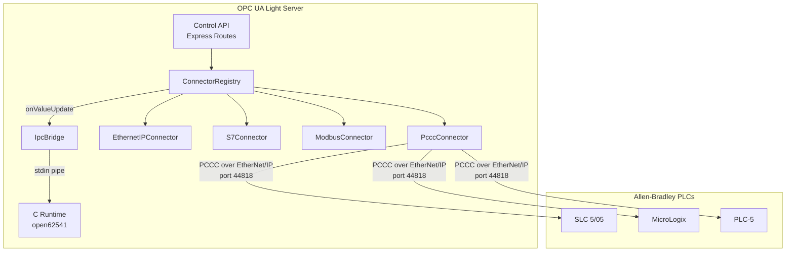
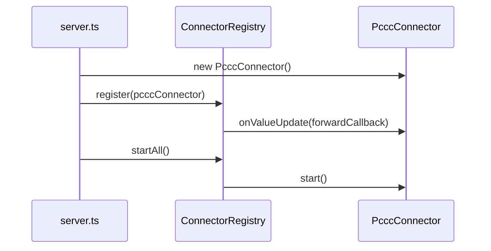
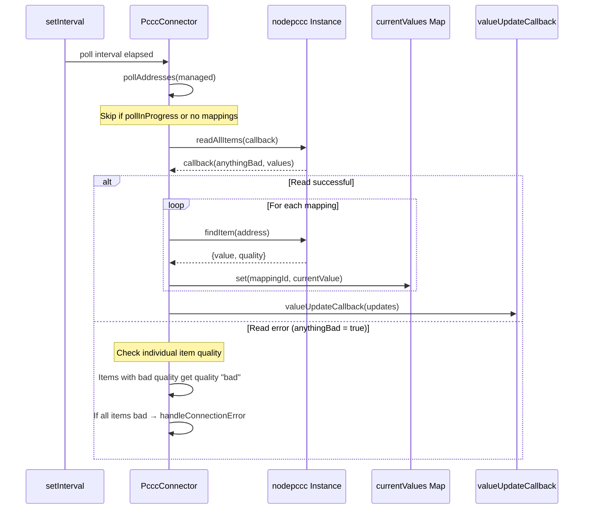
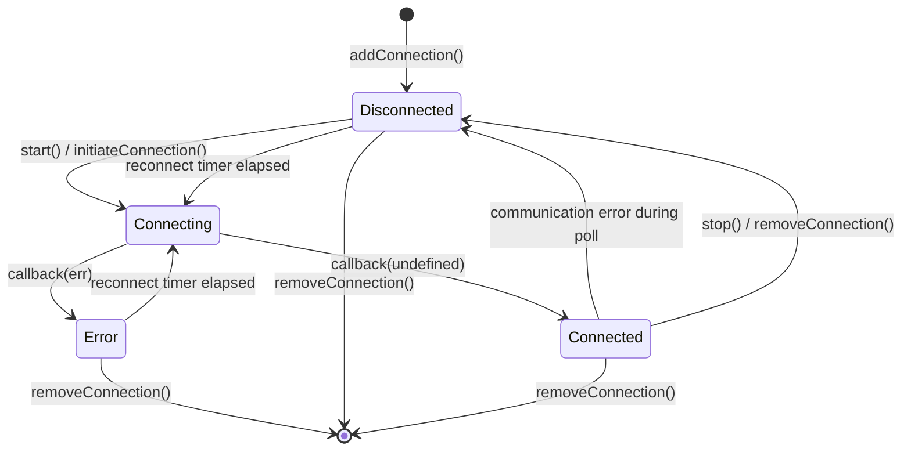

# Design Document: PCCC Connector

## Overview

The PCCC Connector adds support for Allen-Bradley legacy PLCs (SLC 500, MicroLogix, PLC-5, and older CompactLogix in PCCC mode) to the OPC UA Light Server's multi-protocol connector system. It encapsulates PCCC messages over EtherNet/IP (CIP transport) using the `nodepccc` npm library.

The connector follows the same architecture as the existing EtherNet/IP, S7, and Modbus TCP connectors — implementing the shared `Connector` interface with connection lifecycle management, periodic polling, automatic reconnection, quality status propagation, and value caching.

**Key Design Decisions:**
- **Library choice:** `nodepccc` — the standard Node.js library for PCCC-over-EtherNet/IP. It manages internal read optimization (grouping nearby addresses into single requests) and provides built-in reconnection.
- **Testable subclass pattern:** Same pattern as EthernetIPConnector — a `protected createPLC()` factory method allows injecting mock clients in unit tests.
- **Address pass-through:** PCCC file-based addresses (N7:0, F8:1, B3:0/5, T4:0.ACC) are passed directly to `nodepccc` as absolute addresses via `setTranslationCB`, with validation performed at mapping time.

## Architecture

### System Context



### Connector Registration Flow



## Components and Interfaces

### Class Diagram

```mermaid
classDiagram
    class Connector {
        <<interface>>
        +getType() ConnectorType
        +start() void
        +stop() void
        +addConnection(config) void
        +removeConnection(id) void
        +updateConnection(config) void
        +addMapping(mapping) void
        +removeMapping(id) void
        +getStatus() ConnectionStatus[]
        +getCurrentValues() CurrentValue[]
        +onValueUpdate(callback) void
    }

    class PcccConnector {
        -connections Map~string, ManagedPcccConnection~
        -running boolean
        -valueUpdateCallback ValueUpdateCallback | null
        -currentValues Map~string, CurrentValue~
        +getType() ConnectorType
        +start() void
        +stop() void
        +addConnection(config) void
        +removeConnection(id) void
        +updateConnection(config) void
        +addMapping(mapping) void
        +removeMapping(id) void
        +getStatus() ConnectionStatus[]
        +getCurrentValues() CurrentValue[]
        +onValueUpdate(callback) void
        #createPLC() NodePCCC
        -extractParams(config) PcccParams
        -initiateConnection(managed) void
        -handleConnectionError(managed, err) void
        -startPolling(managed) void
        -pollAddresses(managed) void
        -stopPolling(managed) void
        -scheduleReconnect(managed) void
        -emitQualityUpdate(managed, quality) void
        -disconnectAndCleanup(managed) void
        -log(level, name, msg) void
    }

    class ManagedPcccConnection {
        +config ConnectionConfig
        +host string
        +port number
        +slot number
        +routing number[] | undefined
        +plc NodePCCC | null
        +state ConnectionStatus.state
        +lastPollAt Date | undefined
        +errorMessage string | undefined
        +pollingTimer ReturnType~setInterval~ | null
        +reconnectTimer ReturnType~setTimeout~ | null
        +pollInProgress boolean
        +mappings Map~string, Mapping~
        +connecting boolean
    }

    class NodePCCC {
        <<external library>>
        +initiateConnection(params, callback) void
        +dropConnection() void
        +setTranslationCB(translator) void
        +addItems(items) void
        +removeItems(items) void
        +readAllItems(callback) void
        +findItem(item) ItemObject
    }

    Connector <|.. PcccConnector
    PcccConnector *-- ManagedPcccConnection
    ManagedPcccConnection o-- NodePCCC
```



### File-Based Address Parsing

PCCC uses Allen-Bradley file-based addressing. The connector validates addresses at mapping time using a regex pattern:

```
Pattern: /^([A-Z])(\d+)?:(\d+)(\/(\d+|DN|EN|TT|ACC|PRE|LEN|POS|CU|CD|OV|UN|UA))?(\.\w+)?(,\d+)?$/i
```

**Supported file types:**

| Prefix | File Type | Description | Value Type |
|--------|-----------|-------------|------------|
| N | Integer | 16-bit signed integers | number |
| F | Float | 32-bit IEEE float | number |
| B | Binary/Bit | Bit-level access | number (0/1) |
| T | Timer | Timer structure (ACC, PRE, DN, EN, TT) | number or object |
| C | Counter | Counter structure (ACC, PRE, CU, CD, DN, OV, UN, UA) | number or object |
| S | Status | System status file | number |
| L | Long Integer | 32-bit integer (MicroLogix/CLX only) | number |
| O | Output | Direct output points | number |
| I | Input | Direct input points | number |
| R | Control | Control structure (LEN, POS) | number or object |
| ST | String | String data (limited support) | string |

**Address format:** `<FileType><FileNumber>:<Element>[/<Bit>][.SubElement][,ArrayLength]`

**Examples:**
- `N7:0` — Integer file 7, element 0
- `F8:1` — Float file 8, element 1
- `B3:0/5` — Binary file 3, element 0, bit 5
- `T4:0.ACC` — Timer file 4, element 0, accumulator
- `C5:0.PRE` — Counter file 5, element 0, preset
- `S:1` — Status file, element 1 (file number implied as 2)
- `N7:0,10` — Array of 10 integers starting at N7:0

### Data Flow — Polling Cycle



### Connection Lifecycle



## Data Models

### ManagedPcccConnection Interface

```typescript
interface ManagedPcccConnection {
  config: ConnectionConfig;
  host: string;
  port: number;
  slot: number;
  routing: number[] | undefined;
  plc: NodePCCC | null;
  state: ConnectionStatus['state'];
  lastPollAt?: Date;
  errorMessage?: string;
  pollingTimer: ReturnType<typeof setInterval> | null;
  reconnectTimer: ReturnType<typeof setTimeout> | null;
  pollInProgress: boolean;
  mappings: Map<string, Mapping>;
  connecting: boolean;
}
```

### Connection Parameters (extracted from ConnectionConfig.params)

```typescript
interface PcccParams {
  host: string;        // Required — PLC IP address or hostname
  port: number;        // Optional, default 44818
  slot: number;        // Optional, default 0
  routing?: number[];  // Optional — CIP routing path for ControlLogix chassis
}
```

### nodepccc Library Interaction Model

The `nodepccc` library uses an event-driven API with callbacks. Key interaction points:

1. **Connection:** `initiateConnection({host, port, routing}, callback)` — establishes TCP + EtherNet/IP session
2. **Address registration:** `setTranslationCB(fn)` sets a lookup function, then `addItems(addresses)` registers addresses for polling
3. **Reading:** `readAllItems(callback)` reads all registered items, then `findItem(address)` retrieves individual values with `.value` and `.quality` properties
4. **Disconnection:** `dropConnection()` terminates the TCP session

The connector wraps these callbacks in a promise-like flow using a `connected` callback to transition to the polling state.


## Correctness Properties

*A property is a characteristic or behavior that should hold true across all valid executions of a system—essentially, a formal statement about what the system should do. Properties serve as the bridge between human-readable specifications and machine-verifiable correctness guarantees.*

### Property 1: Only enabled connections are initiated on start

*For any* set of managed connections with varying `enabled` states, calling `start()` SHALL initiate connections only for those where `enabled` is true, and SHALL not initiate connections for those where `enabled` is false.

**Validates: Requirements 3.1, 3.2**

### Property 2: Start and stop are idempotent

*For any* connector state, calling `start()` N times (N ≥ 1) SHALL produce the same observable state as calling `start()` once. Similarly, calling `stop()` M times (M ≥ 1) SHALL produce the same state as calling `stop()` once, without throwing errors.

**Validates: Requirements 3.4, 3.5**

### Property 3: Connection state transitions are correct

*For any* connection attempt, if the connection callback receives no error, the state SHALL be "connected". If the callback receives an error and the connection was never previously connected, the state SHALL be "error". If the callback receives an error and the connection was previously in state "connected", the state SHALL be "disconnected".

**Validates: Requirements 4.2, 4.3, 4.4**

### Property 4: Valid PCCC file addresses are accepted

*For any* valid PCCC file-based address (matching the pattern `<FileType><FileNumber>:<Element>[/<Bit>][.SubElement][,ArrayLength]` with supported file types N, F, B, T, C, S, L, O, I, R, ST), adding a mapping with that address SHALL succeed without error.

**Validates: Requirements 5.1**

### Property 5: Poll results are correctly partitioned

*For any* set of mappings where some have a `nodeId` and some have `nodeId` set to null, after a successful poll cycle: (a) ALL mappings SHALL have their values cached in `currentValues` regardless of nodeId, and (b) the `valueUpdateCallback` SHALL receive updates ONLY for mappings that have a non-null nodeId.

**Validates: Requirements 6.2, 6.3**

### Property 6: Reconnection is scheduled at the configured interval

*For any* connection with a configured `reconnectIntervalMs` value, when a connection error or read error occurs while the connector is running, a reconnection attempt SHALL be scheduled exactly after `reconnectIntervalMs` milliseconds.

**Validates: Requirements 7.1, 7.2**

### Property 7: Successful connection emits quality "good" for all mappings

*For any* set of mappings associated with a connection, when that connection transitions to "connected" (whether initial connection or reconnection), the connector SHALL emit quality "good" for every mapping in that set that has a non-null nodeId.

**Validates: Requirements 7.4, 8.1**

### Property 8: Connection or read error emits quality "bad" for all mappings

*For any* set of mappings associated with a connection, when a connection error or read error occurs, the connector SHALL emit quality "bad" for every mapping in that set that has a non-null nodeId.

**Validates: Requirements 8.2, 8.3**

### Property 9: Cache quality reflects latest status

*For any* mapping whose quality status changes (from "good" to "bad" or vice versa), the cached `CurrentValue` entry for that mapping SHALL immediately reflect the new quality value and updated timestamp.

**Validates: Requirements 8.4**

### Property 10: Status and value reports contain all required fields

*For any* managed connection, `getStatus()` SHALL return an object containing `connectionId` and `state`. *For any* cached mapping value, `getCurrentValues()` SHALL return objects containing `nodeId`, `deviceAddress`, `connectionId`, `value`, `quality`, and `timestamp`.

**Validates: Requirements 9.1, 9.2**

## Error Handling

### Connection Errors

| Error Type | Source | Action |
|-----------|--------|--------|
| Connection refused/timeout | `initiateConnection` callback | Set state to "error", record message, emit quality "bad", schedule reconnect |
| TCP socket error (ECONNRESET, EPIPE) | During poll | Set state to "disconnected", emit quality "bad", schedule reconnect |
| DNS resolution failure | `initiateConnection` callback | Set state to "error", record message, schedule reconnect |

### Read Errors

| Error Type | Source | Action |
|-----------|--------|--------|
| All items bad quality | `readAllItems` callback | Treat as connection loss, set state to "disconnected", schedule reconnect |
| Partial bad quality | `readAllItems` + `findItem` | Emit individual bad quality for affected items only, continue polling |
| Timeout | `readAllItems` not returning | Handled by nodepccc internally; if persistent, items show bad quality |

### Reconnection Strategy

1. On any connection or all-bad-quality error, stop polling timer
2. Set quality "bad" for all affected mappings
3. Call `dropConnection()` on the nodepccc instance
4. Wait `reconnectIntervalMs` milliseconds
5. Create a new nodepccc instance via `createPLC()`
6. Call `initiateConnection()` with the same parameters
7. On success: set state "connected", emit quality "good", restart polling
8. On failure: repeat from step 1

**Guard conditions:**
- If `this.running === false`, skip reconnection (connector was stopped)
- If `managed.connecting === true`, skip (already attempting)
- Clear any existing reconnect timer before scheduling a new one

### Address Validation Errors

Invalid addresses are rejected at `addMapping()` time with a descriptive error message indicating the expected format. This is a fail-fast design — bad addresses never reach the nodepccc library.

## Testing Strategy

### Unit Tests (`tests/unit/pccc-connector.test.ts`)

**Approach:** Testable subclass pattern — `TestablePcccConnector` overrides `protected createPLC()` to return a mock nodepccc instance with controllable `initiateConnection`, `dropConnection`, `readAllItems`, `findItem`, `addItems`, and `removeItems` methods.

**Test categories:**

1. **Type identification** — `getType()` returns "pccc"
2. **Parameter extraction** — host required, port defaults to 44818, slot defaults to 0, routing optional
3. **Connection lifecycle** — add, remove, update, start, stop, idempotency
4. **Polling behavior** — value emission, interval timing, skip when no mappings
5. **Reconnection logic** — schedule after connection error, schedule after read error, no reconnect when stopped
6. **Quality status** — good on connect, bad on error, good on reconnect, cache updates
7. **Status/value reporting** — getStatus shape, getCurrentValues shape, empty state

### Property-Based Tests (`tests/property/pccc-connector.test.ts`)

**Library:** fast-check 3

**Properties to implement:**

| Property | Generator Strategy |
|----------|-------------------|
| P1: Enabled filtering | Generate arrays of ConnectionConfig with random enabled flags |
| P2: Idempotence | Generate random call sequences of start/stop |
| P3: State transitions | Generate sequences of connect success/failure events |
| P4: Address validation | Generate valid PCCC addresses from grammar (file type × file number × element × optional sub-parts) |
| P5: Poll partitioning | Generate arrays of Mapping with random nodeId presence |
| P7: Quality good on connect | Generate random mapping counts (1-20) |
| P8: Quality bad on error | Generate random mapping counts (1-20) |

**Configuration:**
- Minimum 100 iterations per property
- Each test tagged with: `Feature: pccc-connector, Property {N}: {description}`

### Files to Create

| File | Purpose |
|------|---------|
| `src/connectors/pccc/index.ts` | PcccConnector class implementation |
| `tests/unit/pccc-connector.test.ts` | Unit tests with testable subclass |
| `tests/property/pccc-connector.test.ts` | Property-based tests |

### Files to Modify

| File | Change |
|------|--------|
| `src/connectors/index.ts` | Add `export { PcccConnector } from './pccc/index.js'` |
| `src/connectors/types.ts` | Add `'pccc'` to `ConnectorType` union |
| `src/api/server.ts` | Import PcccConnector, instantiate, register in ConnectorRegistry |
| `package.json` | Add `nodepccc` dependency |

