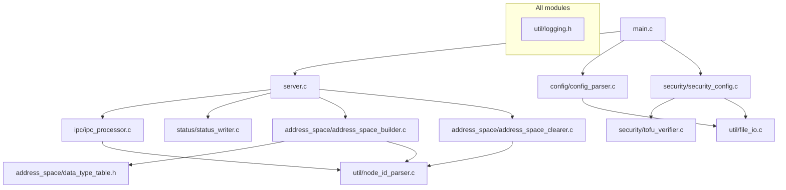
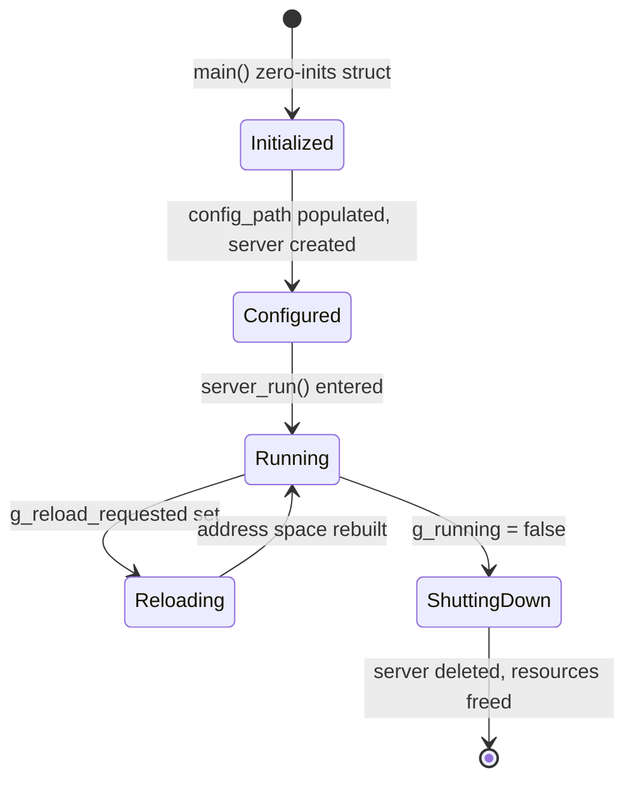

# Design Document: Runtime Modular Refactor

## Overview

This design decomposes the monolithic 1,556-line `runtime/src/main.c` into a modular directory structure organized by domain responsibility. The refactoring is purely structural — no functional behavior changes. The runtime continues to serve OPC UA clients identically with the same JSON config, IPC protocol, and status file format.

The key architectural changes are:

1. **Module extraction** — Code grouped into `config/`, `address_space/`, `ipc/`, `status/`, `security/`, and `util/` subdirectories
2. **State consolidation** — All global mutable state (except signal flags) moved into a `RuntimeContext` struct
3. **Shared utilities** — Duplicated NodeId parsing extracted into a single `parse_node_id_string` function
4. **Library adoption** — Hand-rolled base64 decoder replaced with OpenSSL `EVP_DecodeBlock`
5. **Table-driven dispatch** — If-else data type chains replaced with a static lookup table
6. **Correctness fixes** — Object node deletion made recursive to match recursive creation
7. **I/O optimization** — Status file writes skipped when session state is unchanged
8. **Structured logging** — `LOG_ERROR`/`LOG_WARN`/`LOG_INFO` macros replace raw printf/fprintf

## Architecture

```
runtime/
├── include/
│   └── runtime_context.h          # RuntimeContext struct definition
├── src/
│   ├── main.c                     # Entry point (~150 lines): arg parsing, lifecycle, signal setup
│   ├── server.c / server.h        # Server creation, run loop, shutdown orchestration
│   ├── config/
│   │   ├── config_parser.c        # JSON config reading and validation
│   │   └── config_parser.h
│   ├── address_space/
│   │   ├── address_space_builder.c  # Namespace registration, object/variable node creation
│   │   ├── address_space_builder.h
│   │   ├── address_space_clearer.c  # Recursive node deletion for reload
│   │   ├── address_space_clearer.h
│   │   └── data_type_table.h        # Static const type mapping table
│   ├── ipc/
│   │   ├── ipc_processor.c         # Stdin reading, JSON parsing, value updates
│   │   └── ipc_processor.h
│   ├── status/
│   │   ├── status_writer.c         # Status JSON generation, change detection, file write
│   │   └── status_writer.h
│   ├── security/
│   │   ├── security_config.c       # PEM→DER, policy registration, endpoint filtering
│   │   ├── security_config.h
│   │   ├── tofu_verifier.c         # Existing TOFU verifier (moved here)
│   │   └── tofu_verifier.h
│   └── util/
│       ├── logging.h               # LOG_ERROR/LOG_WARN/LOG_INFO macros
│       ├── file_io.c               # read_file, read_file_binary helpers
│       ├── file_io.h
│       ├── node_id_parser.c        # parse_node_id_string utility
│       └── node_id_parser.h
└── CMakeLists.txt
```

### Dependency Flow (Mermaid)



### Design Decisions

| Decision | Rationale |
|----------|-----------|
| `RuntimeContext` on stack in `main()` | Avoids heap allocation/free; lifetime is exactly program lifetime. Pointer passed to all functions. |
| Signal flags remain global | POSIX signal handlers and Windows `CTRL_HANDLER` cannot receive user data. Only `g_running` and `g_reload_requested` stay global. |
| Headers in subdirectories (not a flat `include/`) | Module headers co-locate with their `.c` files. Only `runtime_context.h` lives in top-level `include/` since every module depends on it. |
| `data_type_table.h` as header-only | Static const data that the compiler can inline. No separate `.c` needed. |
| OpenSSL `EVP_DecodeBlock` over `BIO` | Single-call API vs multi-step BIO chain. Simpler, and the project already links OpenSSL for open62541 encryption. |
| Linear search for type table | 12 entries — linear is simpler and faster than a hash for this size. |
| Status change detection via JSON string comparison | Comparing the serialized JSON string to the previously written one is simpler than tracking individual fields, and guarantees correctness. |

## Components and Interfaces

### RuntimeContext (`include/runtime_context.h`)

```c
#ifndef RUNTIME_CONTEXT_H
#define RUNTIME_CONTEXT_H

#include <open62541/server.h>
#include "security/tofu_verifier.h"

#ifdef _WIN32
#include <windows.h>
#endif

typedef struct {
    /* OPC UA server handle */
    UA_Server *server;

    /* File paths */
    char config_path[4096];
    char status_path[4096];

    /* TOFU verifier state */
    TofuVerifierContext tofu_ctx;

    /* Stdin IPC buffer */
    char stdin_buffer[65536];
    size_t stdin_buffer_len;

    /* Status change detection */
    char *last_status_json;  /* heap-allocated, NULL on first call */

#ifdef _WIN32
    /* Windows threading handles */
    HANDLE stdin_thread;
    HANDLE pipe_thread;
    volatile LONG stdin_running;
    volatile LONG pipe_running;
    CRITICAL_SECTION stdin_cs;
    char *stdin_queue[256];
    volatile LONG stdin_queue_head;
    volatile LONG stdin_queue_tail;
#endif
} RuntimeContext;

#endif /* RUNTIME_CONTEXT_H */
```

### Module Public Interfaces

**config/config_parser.h**
```c
/* Read and parse a JSON config file. Returns cJSON root (caller frees) or NULL on error. */
cJSON *config_parse_file(const char *path);
```

**address_space/address_space_builder.h**
```c
/* Build the OPC UA address space from parsed config. Returns 0 on success, -1 on error. */
int address_space_build(UA_Server *server, cJSON *config);
```

**address_space/address_space_clearer.h**
```c
/* Recursively delete all custom nodes prior to reload. */
void address_space_clear(UA_Server *server, const char *config_path);
```

**ipc/ipc_processor.h**
```c
/* Initialize IPC (start stdin reader thread on Windows, set non-blocking on POSIX). */
void ipc_init(RuntimeContext *ctx);

/* Process pending stdin lines and apply value updates. Called from repeated callback. */
void ipc_process(RuntimeContext *ctx);

/* Cleanup IPC resources (stop threads on Windows). */
void ipc_shutdown(RuntimeContext *ctx);
```

**status/status_writer.h**
```c
/* Write status.json if session state has changed since last write. */
void status_write_if_changed(RuntimeContext *ctx);
```

**security/security_config.h**
```c
/* Configure security on the server. Returns 0 on success, -1 on error. */
int security_configure(RuntimeContext *ctx, cJSON *security_json);
```

**util/node_id_parser.h**
```c
/* Parse "ns=X;s=StringId" into a UA_NodeId. Returns 0 on success, -1 on failure. */
int parse_node_id_string(const char *str, UA_NodeId *out_id);
```

**util/file_io.h**
```c
/* Read a text file. Returns malloc'd string (caller frees) or NULL on error. */
char *file_read_text(const char *path);

/* Read a binary file into a UA_ByteString. Returns UA_BYTESTRING_NULL on error. */
UA_ByteString file_read_binary(const char *path);
```

**util/logging.h**
```c
#ifndef LOGGING_H
#define LOGGING_H

#include <stdio.h>

#define LOG_ERROR(fmt, ...) do { \
    if (fmt) { fprintf(stderr, "[ERROR] " fmt "\n", ##__VA_ARGS__); fflush(stderr); } \
} while (0)

#define LOG_WARN(fmt, ...) do { \
    if (fmt) { fprintf(stderr, "[WARN] " fmt "\n", ##__VA_ARGS__); fflush(stderr); } \
} while (0)

#define LOG_INFO(fmt, ...) do { \
    if (fmt) { fprintf(stdout, "[INFO] " fmt "\n", ##__VA_ARGS__); fflush(stdout); } \
} while (0)

#endif /* LOGGING_H */
```

**server.h**
```c
/* Create and configure the server. Returns 0 on success. */
int server_create(RuntimeContext *ctx);

/* Run the server loop (blocks until g_running is false). Returns UA_StatusCode. */
UA_StatusCode server_run(RuntimeContext *ctx);

/* Shutdown and delete the server. */
void server_shutdown(RuntimeContext *ctx);
```

### Data Type Table (`address_space/data_type_table.h`)

```c
#ifndef DATA_TYPE_TABLE_H
#define DATA_TYPE_TABLE_H

#include <open62541/server.h>

typedef struct {
    const char *name;
    UA_UInt32 ns0_id;
    size_t ua_types_index;
} DataTypeEntry;

static const DataTypeEntry DATA_TYPE_TABLE[] = {
    {"Boolean",    UA_NS0ID_BOOLEAN,    UA_TYPES_BOOLEAN},
    {"Int16",      UA_NS0ID_INT16,      UA_TYPES_INT16},
    {"Int32",      UA_NS0ID_INT32,      UA_TYPES_INT32},
    {"Int64",      UA_NS0ID_INT64,      UA_TYPES_INT64},
    {"UInt16",     UA_NS0ID_UINT16,     UA_TYPES_UINT16},
    {"UInt32",     UA_NS0ID_UINT32,     UA_TYPES_UINT32},
    {"UInt64",     UA_NS0ID_UINT64,     UA_TYPES_UINT64},
    {"Float",      UA_NS0ID_FLOAT,      UA_TYPES_FLOAT},
    {"Double",     UA_NS0ID_DOUBLE,     UA_TYPES_DOUBLE},
    {"String",     UA_NS0ID_STRING,     UA_TYPES_STRING},
    {"DateTime",   UA_NS0ID_DATETIME,   UA_TYPES_DATETIME},
    {"ByteString", UA_NS0ID_BYTESTRING, UA_TYPES_BYTESTRING},
};

#define DATA_TYPE_TABLE_SIZE (sizeof(DATA_TYPE_TABLE) / sizeof(DATA_TYPE_TABLE[0]))

#endif /* DATA_TYPE_TABLE_H */
```

## Data Models

### RuntimeContext State Flow



### JSON Configuration Model (consumed by config_parser)

```json
{
  "namespaces": [
    {
      "name": "MyNamespace",
      "uri": "urn:my:ns",
      "objectNodes": [
        { "name": "Folder1", "path": "Folder1", "children": [...] }
      ],
      "nodes": [
        { "name": "Temp", "nodeId": "ns=1;s=Temp", "dataType": "Double", "parentPath": "Folder1", "initialValue": 23.5 }
      ]
    }
  ],
  "security": {
    "mode": "SignAndEncrypt",
    "certificatePath": "...",
    "privateKeyPath": "...",
    "applicationUri": "urn:...",
    "pkiTrustedPath": "...",
    "pkiRejectedPath": "..."
  }
}
```

### Status File Model (produced by status_writer)

```json
{
  "connectedClients": 2,
  "sessions": [
    {
      "applicationName": "UaExpert",
      "applicationUri": "urn:...",
      "securityPolicyUri": "http://opcfoundation.org/UA/SecurityPolicy#Basic256Sha256",
      "clientAddress": "192.168.1.10:52431",
      "connectTime": "2024-01-15T10:30:00.000Z",
      "sessionState": "Activated"
    }
  ]
}
```

### NodeId String Format

The `parse_node_id_string` utility parses strings of the form:
```
ns=<uint16>;s=<non-empty-string>
```

Where:
- `<uint16>` is a decimal integer in range [0, 65535]
- `<non-empty-string>` is at least one character (the OPC UA string identifier)

## Correctness Properties

*A property is a characteristic or behavior that should hold true across all valid executions of a system — essentially, a formal statement about what the system should do. Properties serve as the bridge between human-readable specifications and machine-verifiable correctness guarantees.*

### Property 1: NodeId parsing round-trip

*For any* string `s`, if `s` matches the pattern `ns=<digits>;s=<id>` where `<digits>` is in [0, 65535] and `<id>` is non-empty, then `parse_node_id_string(s, &out)` shall return 0 and `out` shall have namespace index equal to `<digits>` and string identifier equal to `<id>`. Conversely, *for any* string that is NULL, empty, lacks the `ns=` prefix, has a namespace > 65535, or lacks `;s=` followed by at least one character, `parse_node_id_string` shall return -1.

**Validates: Requirements 3.2, 3.3**

### Property 2: PEM-to-DER base64 decode round-trip

*For any* random byte sequence `B`, encoding `B` as base64, wrapping it in PEM header/footer lines, and then passing it through the Security_Module's PEM-to-DER conversion shall produce output bytes identical to the original `B`.

**Validates: Requirements 4.3**

### Property 3: Recursive deletion is post-order and exhaustive

*For any* tree of object nodes (arbitrary depth and branching factor), the Address_Space_Clearer shall visit every node in the tree exactly once, and shall delete each parent node only after all its descendants have been deleted (post-order).

**Validates: Requirements 5.1, 5.2**

### Property 4: Variable nodes deleted before object nodes

*For any* namespace configuration containing both variable nodes and object nodes, the Address_Space_Clearer shall delete all variable nodes in that namespace before deleting any object node or the namespace root node.

**Validates: Requirements 5.3**

### Property 5: Logging macros produce correctly prefixed output

*For any* non-NULL format string and arguments, `LOG_ERROR(fmt, ...)` shall produce exactly `[ERROR] <formatted>\n` on stderr, `LOG_WARN(fmt, ...)` shall produce exactly `[WARN] <formatted>\n` on stderr, and `LOG_INFO(fmt, ...)` shall produce exactly `[INFO] <formatted>\n` on stdout. The stream shall be flushed after each write.

**Validates: Requirements 6.2, 6.3, 6.4, 6.7**

### Property 6: Data type table lookup correctness

*For any* type name string that exactly matches one of the 12 supported OPC UA type names, `get_data_type_id` shall return the corresponding `UA_NS0ID_*` value. *For any* type name string that does not match any entry, `get_data_type_id` shall return `UA_NS0ID_DOUBLE`.

**Validates: Requirements 7.2**

### Property 7: Initial value creation preserves type and value

*For any* supported numeric type name and *for any* numeric value representable in that type, calling `create_initial_value(type, json_value)` shall produce a `UA_Variant` whose data type matches the table entry's `UA_TYPES` index and whose stored value equals the input value (within floating-point precision for Float/Double). *For any* string value, the resulting `UA_String` shall contain the same characters as the input.

**Validates: Requirements 7.3, 7.5**

### Property 8: Status write occurs if and only if state changed

*For any* two consecutive invocations of `status_write_if_changed` with session state S1 and S2: if S1 equals S2, the file shall not be rewritten; if S1 differs from S2, the file shall be written with the new state.

**Validates: Requirements 8.2, 8.3**

## Error Handling

| Module | Error Condition | Handling |
|--------|----------------|----------|
| config_parser | File not found or unreadable | `LOG_ERROR`, return NULL |
| config_parser | Invalid JSON syntax | `LOG_ERROR` with position hint, return NULL |
| config_parser | Missing `namespaces` array | `LOG_ERROR`, free parsed JSON, return NULL |
| security_config | Missing cert/key paths for Sign/SignAndEncrypt | `LOG_ERROR`, return -1 |
| security_config | Certificate/key file unreadable | `LOG_ERROR`, return -1 |
| security_config | PEM detected but base64 decode fails (EVP_DecodeBlock ≤ 0) | `LOG_ERROR`, free buffers, return -1 |
| security_config | `UA_ServerConfig_setDefaultWithSecurityPolicies` fails | `LOG_ERROR`, return -1 |
| address_space_builder | Node creation fails (duplicate ID, invalid parent) | `LOG_WARN`, continue with remaining nodes |
| address_space_builder | Namespace missing `uri` | `LOG_WARN`, skip namespace |
| address_space_clearer | Node doesn't exist during deletion | Skip silently, continue traversal |
| address_space_clearer | Config file unreadable during reload | `LOG_ERROR`, abort clear (leave address space intact) |
| ipc_processor | JSON parse failure on stdin line | Discard line, continue processing |
| ipc_processor | Unknown IPC message type | Discard, continue |
| ipc_processor | Value write fails | `LOG_WARN` with node ID and status code |
| ipc_processor | stdin queue full (Windows) | Drop oldest line |
| status_writer | Status path empty | Skip write |
| status_writer | Cannot open file for writing | `LOG_WARN`, skip this cycle |
| status_writer | cJSON allocation failure | `LOG_ERROR`, skip write |
| node_id_parser | NULL, empty, or malformed input | Return -1, leave `out_id` unchanged |
| file_io | malloc failure | `LOG_ERROR`, return NULL/empty |
| main | Missing argv[1] | Print usage to stderr, exit(EXIT_FAILURE) |
| main | Server creation fails | `LOG_ERROR`, exit(EXIT_FAILURE) |
| main | Security configuration fails | `LOG_ERROR`, delete server, exit(EXIT_FAILURE) |
| main | Address space build fails | `LOG_ERROR`, delete server, exit(EXIT_FAILURE) |

### Error Propagation Strategy

- **Fatal errors** (config parse failure, server creation failure, security failure) propagate up to `main()` which logs and exits with `EXIT_FAILURE`.
- **Non-fatal errors** (individual node creation failures, value write failures) are logged at WARN level and execution continues.
- **Reload errors** (config re-read failure) leave the existing address space intact and log at ERROR level.
- **No exceptions** — C11 uses integer return codes. 0 = success, -1 = failure. Pointers return NULL on failure.

## Testing Strategy

### Unit Tests (example-based)

Unit tests verify specific scenarios and edge cases:

- `parse_node_id_string` with known valid inputs (e.g., `"ns=1;s=Temperature"`)
- `parse_node_id_string` with known invalid inputs (NULL, `""`, `"ns=99999;s="`, `"ns=abc;s=x"`)
- `get_data_type_id` returns correct ID for each of the 12 supported types
- `get_data_type_id` returns `UA_NS0ID_DOUBLE` for `"Unknown"` and `NULL`
- `create_initial_value` for Boolean true/false
- `create_initial_value` for String with empty and non-empty values
- `create_initial_value` for NULL `value_json` (zero-initialized defaults)
- Status writer first-call writes unconditionally
- Logging macros with NULL format produce no output
- PEM decode with corrupted base64 returns -1
- Address space clearer handles non-existent nodes gracefully

### Property-Based Tests (fast-check)

Property-based tests use [fast-check](https://github.com/dubzzz/fast-check) to verify universal properties across randomized inputs. Since the runtime is C code but the project already uses fast-check for TypeScript testing, these properties will be tested against C utility functions compiled as a Node.js native addon (using node-addon-api) OR via subprocess invocation with JSON I/O for integration-level properties.

Each property test runs a minimum of 100 iterations and is tagged with the design property it validates.

| Property | Test Tag | Generator Strategy |
|----------|----------|-------------------|
| 1: NodeId parsing | `Feature: runtime-modular-refactor, Property 1: NodeId parsing round-trip` | Generate random (ns_index ∈ [0,65535], identifier ∈ non-empty ASCII strings) for valid cases; generate malformed strings for invalid cases |
| 2: PEM decode round-trip | `Feature: runtime-modular-refactor, Property 2: PEM-to-DER base64 decode round-trip` | Generate random byte arrays (1–4096 bytes), encode as base64 with PEM wrapping |
| 3: Post-order deletion | `Feature: runtime-modular-refactor, Property 3: Recursive deletion is post-order and exhaustive` | Generate random trees (depth 1–5, branching 0–4), record deletion order |
| 4: Variable-before-object deletion | `Feature: runtime-modular-refactor, Property 4: Variable nodes deleted before object nodes` | Generate configs with random mixes of variable and object nodes |
| 5: Logging format | `Feature: runtime-modular-refactor, Property 5: Logging macros produce correctly prefixed output` | Generate random printable strings as format arguments |
| 6: Type lookup | `Feature: runtime-modular-refactor, Property 6: Data type table lookup correctness` | Generate random strings; subset from the known 12 type names, rest arbitrary |
| 7: Initial value type | `Feature: runtime-modular-refactor, Property 7: Initial value creation preserves type and value` | Generate random (type, value) pairs within type ranges |
| 8: Status write idempotence | `Feature: runtime-modular-refactor, Property 8: Status write occurs if and only if state changed` | Generate random session states; pair identical and differing states |

### Integration Tests

- Build the refactored runtime and verify it compiles with zero warnings
- Start the runtime with a test config, verify `status.json` is produced
- Send a value update via stdin, verify the node value changes
- Send a reload signal, verify the address space is rebuilt
- Verify the output binary path matches the pre-refactor location

### Build Verification (CI)

- `cmake --build .` succeeds on Windows (MSVC), Linux (GCC), macOS (Clang)
- No warnings with `-Wall -Wextra -Wpedantic`
- Binary name is `opcua-runtime` (or `opcua-runtime.exe` on Windows)

