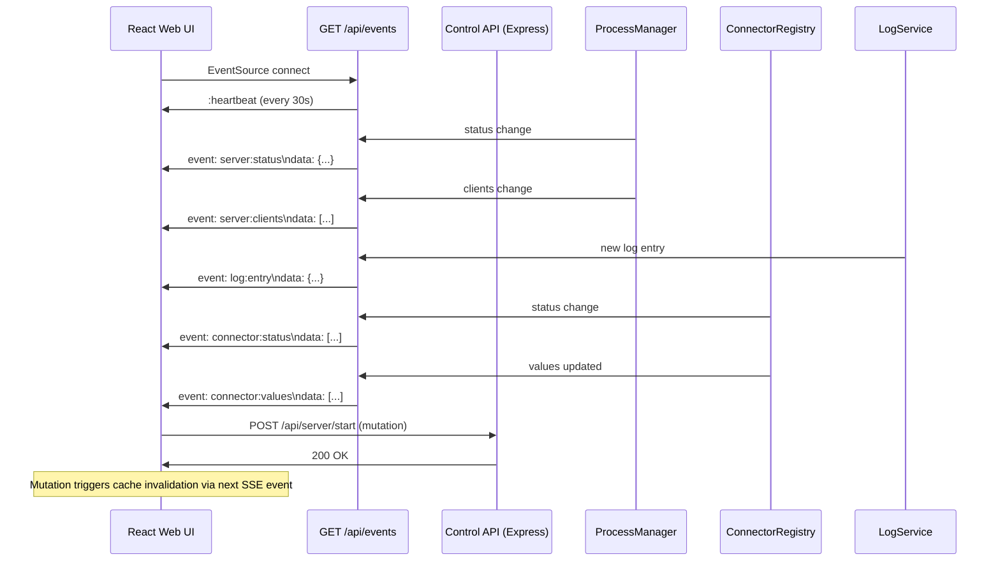

# Design Document: SSE Real-Time Updates

## Overview

This feature introduces a Server-Sent Events (SSE) endpoint that replaces 8 polling loops in the React Web UI with a single persistent connection. The server pushes multiplexed events (server status, client sessions, logs, connector status, connector values) as they occur, providing true real-time updates with lower latency and reduced network overhead.

The existing REST endpoints remain unchanged — SSE is additive. Mutations continue to use REST, and the frontend uses SSE events to keep the React Query cache fresh.

## Architecture



### Key Design Decisions

1. **Single multiplexed endpoint (`/api/events`)** — One SSE connection carries all event types via named events. This is simpler to manage than multiple SSE connections and maps well to the `EventSource` API.

2. **Event-driven with periodic fallback** — Events are emitted when state actually changes (e.g., connector state transition). For data that changes continuously (like uptime), a periodic emit every 5 seconds provides smooth updates without per-second noise.

3. **EventEmitter hub pattern** — A central `SseHub` class holds connected clients and subscribes to internal event sources (ProcessManager, ConnectorRegistry, LogService). This decouples event producers from the SSE transport.

4. **React Query cache injection** — The frontend SSE hook directly updates React Query's cache using `queryClient.setQueryData()`. Existing components continue reading from `useQuery` hooks — they don't know whether data came from REST or SSE.

5. **No authentication on SSE** — Consistent with existing status/clients endpoints. The Control API is HTTP-only and intended for local/trusted network access.

6. **Graceful degradation** — If SSE cannot connect after 3 retries, the frontend falls back to the original polling pattern. This ensures the UI works even behind aggressive proxies.

## Components and Interfaces

### 1. SSE Hub (Backend)

New file: `src/api/sse-hub.ts`

The SSE Hub manages connected clients and broadcasts events. It follows the Observer pattern — internal services emit events, and the hub relays them to all connected SSE clients.

```typescript
import { EventEmitter } from 'events';
import { Response } from 'express';

export interface SseClient {
  id: string;
  res: Response;
  connectedAt: Date;
}

export type SseEventType =
  | 'server:status'
  | 'server:clients'
  | 'log:entry'
  | 'connector:status'
  | 'connector:values';

export class SseHub extends EventEmitter {
  private clients: Map<string, SseClient> = new Map();
  private heartbeatInterval: NodeJS.Timeout | null = null;

  /** Add a new SSE client connection. */
  addClient(id: string, res: Response): void;

  /** Remove a disconnected client and clean up. */
  removeClient(id: string): void;

  /** Broadcast a named event to all connected clients. */
  broadcast(eventType: SseEventType, data: unknown): void;

  /** Send a named event to a single client (for initial state). */
  sendToClient(id: string, eventType: SseEventType, data: unknown): void;

  /** Start the heartbeat timer (30s interval). */
  startHeartbeat(): void;

  /** Stop the heartbeat and disconnect all clients. */
  shutdown(): void;

  /** Get the number of connected SSE clients. */
  getClientCount(): number;
}
```

### 2. SSE Route (Backend)

Added to `src/api/routes/events.ts`:

```typescript
import { Router, Request, Response } from 'express';
import { SseHub } from '../sse-hub';
import { ProcessManager } from '../../process-manager';
import { ConnectorRegistry } from '../../connectors/connector-registry';

export function createEventsRouter(
  sseHub: SseHub,
  processManager: ProcessManager,
  connectorRegistry: ConnectorRegistry
): Router;
```

The route handler:
- Sets SSE headers (`Content-Type: text/event-stream`, `Cache-Control: no-cache`, `Connection: keep-alive`)
- Registers the client with `SseHub`
- Sends initial state events (server:status, server:clients, connector:status, connector:values)
- Cleans up on `close` event

### 3. Event Source Integration (Backend)

The SSE Hub subscribes to internal services to detect changes:

**ProcessManager integration** (`src/process-manager/`):
- Emit `server:status` when `start()`, `stop()`, or `reload()` complete
- Emit `server:status` every 5 seconds via a status polling timer (reading status.json)
- Emit `server:clients` when the sessions array in status.json changes (detected during periodic read)

**ConnectorRegistry integration** (`src/connectors/connector-registry.ts`):
- Emit `connector:status` when any connector's state changes
- Emit `connector:values` after each poll cycle completes with new values

**LogService integration** (`src/log/`):
- Emit `log:entry` synchronously when a new log entry is appended

Implementation approach: Each service gets a reference to the `SseHub` instance and calls `sseHub.broadcast()` at the appropriate points. This is lightweight — just method calls, no new dependencies.

### 4. Frontend SSE Hook

New file: `web/src/hooks/useSSE.ts`

```typescript
import { useEffect, useRef, useState } from 'react';
import { useQueryClient } from '@tanstack/react-query';

export type SseConnectionState = 'connecting' | 'connected' | 'disconnected' | 'fallback';

export function useSSE(): { connectionState: SseConnectionState } {
  // Creates EventSource to /api/events
  // Routes events to queryClient.setQueryData() by event type
  // Tracks connection state for StatusBar indicator
  // Falls back to polling after 3 failed retries
}
```

**Event-to-QueryKey mapping:**

| SSE Event | Query Key Updated | Action |
|-----------|-------------------|--------|
| `server:status` | `['serverStatus']`, `['server-status']` | `setQueryData` |
| `server:clients` | `['server', 'clients']` | `setQueryData` |
| `log:entry` | — (dispatched to LogPanel via custom event) | Direct state update |
| `connector:status` | `['connectors-status']`, `['s7-status']` | `setQueryData` |
| `connector:values` | `['connectors-values']`, `['s7-values']` | `setQueryData` |

### 5. Log Event Dispatcher (Frontend)

Since the LogPanel uses local state (not React Query), log events are dispatched via a lightweight pub/sub:

New file: `web/src/hooks/useLogStream.ts`

```typescript
type LogListener = (entry: LogEntry) => void;

/** Subscribe to real-time log entries from SSE. */
export function useLogStream(onEntry: LogListener): void;
```

The `useSSE` hook publishes log entries to this channel. The LogPanel subscribes via `useLogStream` and appends entries to its local state buffer.

### 6. Fallback Polling Manager (Frontend)

When SSE is in `fallback` state, the hook re-enables `refetchInterval` on the affected queries:

```typescript
// Inside useSSE hook
useEffect(() => {
  if (connectionState === 'fallback') {
    // Set default options on queryClient to re-enable polling
    // This restores the original behavior as a safety net
  }
}, [connectionState]);
```

### 7. StatusBar SSE Indicator (Frontend)

The StatusBar receives `connectionState` from `useSSE()` and shows a small indicator:
- 🟢 `connected` — real-time active
- 🟡 `connecting` — establishing connection
- 🔴 `disconnected` — reconnecting
- ⚠️ `fallback` — using polling (SSE unavailable)

## Data Models

### SSE Wire Format

Each event follows the standard SSE format:

```
event: server:status
data: {"state":"running","uptime":3600,"pid":1234,"connectedClients":2,"lastError":null}

event: server:clients
data: [{"applicationName":"UaExpert","applicationUri":"urn:UA:UaExpert",...}]

event: log:entry
data: {"level":"info","message":"Server started","timestamp":"2024-01-15T10:30:00Z","source":"runtime"}

event: connector:status
data: [{"id":"conn-1","protocol":"s7","state":"connected","lastPoll":"2024-01-15T10:30:05Z"}]

event: connector:values
data: [{"mappingId":"map-1","value":42.5,"quality":"good","timestamp":"2024-01-15T10:30:05Z"}]
```

### SseEventType Union

```typescript
export type SseEventType =
  | 'server:status'
  | 'server:clients'
  | 'log:entry'
  | 'connector:status'
  | 'connector:values';
```

### SseConnectionState Union

```typescript
export type SseConnectionState = 'connecting' | 'connected' | 'disconnected' | 'fallback';
```

## Correctness Properties

### Property 1: Event Delivery Completeness

*For any* state change that occurs in the backend (server status transition, client connect/disconnect, new log entry, connector state change, connector value update), THE SSE Hub SHALL emit a corresponding event to ALL connected clients within the same event loop tick (synchronous broadcast) — ensuring no connected client misses an event.

**Validates: Requirements 2.1, 3.1, 4.1, 5.1, 6.1**

### Property 2: Initial State Consistency

*For any* new SSE client that connects, THE backend SHALL deliver initial state events for server:status, server:clients, connector:status, and connector:values — such that after receiving these events, the client has a complete and consistent view of the current system state without needing any REST calls.

**Validates: Requirements 2.4, 3.3, 5.3, 6.3**

### Property 3: Cache Coherence

*For any* SSE event received by the frontend, THE useSSE hook SHALL update the React Query cache such that any component reading the corresponding query key immediately sees the new data — preserving the invariant that displayed data is never staler than the last received SSE event.

**Validates: Requirements 7.3, 7.4, 7.5**

### Property 4: Graceful Degradation

*For any* sequence of SSE connection failures, THE frontend SHALL transition to fallback polling mode after exactly 3 consecutive failures — and SHALL restore all original polling intervals for affected queries so that the UI continues to function with the same data freshness as before SSE was introduced.

**Validates: Requirements 7.7**

## Error Handling

| Scenario | Backend Behavior | Frontend Behavior |
|----------|------------------|-------------------|
| Client disconnects abruptly | `close` event fires → remove client, clean up timers | EventSource auto-reconnects |
| Network interruption | Heartbeat detects stale connection on next write (EPIPE) → remove client | EventSource auto-reconnects (retry after ~3s) |
| Backend restart | All SSE connections drop | EventSource reconnects, receives initial state events |
| Malformed event data | — | Frontend ignores events that fail JSON parse |
| Too many SSE clients | Accepted (no limit) but logged as warning at >50 clients | — |
| SSE endpoint unreachable | Returns 502/503 | After 3 retries, transitions to `fallback` mode (polling) |
| Proxy buffering | Heartbeat every 30s prevents proxy from timing out | — |
| LogService emits too fast | Events buffered at OS TCP level (no application-level throttle needed for admin UI) | LogPanel caps at 1000 entries |

## Testing Strategy

### Unit Tests

| Test | File | Scope |
|------|------|-------|
| SseHub adds/removes clients | `tests/unit/sse-hub.test.ts` | Client lifecycle |
| SseHub broadcasts to all clients | `tests/unit/sse-hub.test.ts` | Fan-out delivery |
| SseHub sends heartbeat | `tests/unit/sse-hub.test.ts` | Keep-alive mechanism |
| SseHub sends initial state on connect | `tests/unit/sse-hub.test.ts` | Initial delivery |
| Events route sets correct headers | `tests/unit/events-route.test.ts` | SSE protocol compliance |
| Events route cleans up on disconnect | `tests/unit/events-route.test.ts` | Resource cleanup |
| useSSE updates query cache | `tests/components/useSSE.test.tsx` | Cache injection |
| useSSE transitions to fallback | `tests/components/useSSE.test.tsx` | Degradation logic |
| LogPanel receives stream entries | `tests/components/LogPanel.test.tsx` | SSE→local state flow |

### Integration Tests

| Test | File | Scope |
|------|------|-------|
| Full SSE flow: connect → receive events → disconnect | `tests/integration/sse-events.test.ts` | End-to-end event delivery |
| Multiple clients receive same events | `tests/integration/sse-events.test.ts` | Fan-out verification |
| Server restart → clients reconnect and get state | `tests/integration/sse-events.test.ts` | Recovery behavior |

### Property-Based Tests

| Property | Test File | What It Validates |
|----------|-----------|-------------------|
| Property 1: Delivery Completeness | `tests/property/sse-hub.test.ts` | All clients receive all broadcasted events |
| Property 2: Initial State Consistency | `tests/property/sse-hub.test.ts` | New clients get current state |
| Property 3: Cache Coherence | `tests/components/useSSE.test.tsx` | Query cache matches latest event |

## Migration Notes

### Queries to Remove `refetchInterval` From

| File | Query Key | Current Interval | Replaced By |
|------|-----------|-----------------|-------------|
| `Dashboard.tsx` | `['serverStatus']` | 5000ms | `server:status` event |
| `Dashboard.tsx` | `['server', 'clients']` | 3000ms | `server:clients` event |
| `StatusBar.tsx` | `['server-status']` | 3000ms | `server:status` event |
| `ConnectorsManager.tsx` | `['connectors-status']` | 5000ms | `connector:status` event |
| `ConnectorsManager.tsx` | `['connectors-values']` | 2000ms | `connector:values` event |
| `S7ConnectionManager.tsx` | `['s7-status']` | 5000ms | `connector:status` event |
| `S7ConnectionManager.tsx` | `['s7-values']` | 2000ms | `connector:values` event |

### LogPanel Rewrite

The `LogPanel.tsx` component currently uses a manual `setInterval` + `fetch` pattern. This will be replaced with the `useLogStream` hook that receives entries from the SSE connection. The component's local state management (buffer of 1000 entries, level filtering, auto-scroll) remains unchanged.

### Query Key Consolidation

Currently, `Dashboard.tsx` uses `['serverStatus']` while `StatusBar.tsx` uses `['server-status']` for the same data. The SSE hook will update BOTH query keys from a single `server:status` event, naturally deduplicating the data source.

### StatusBar Security Config

The `StatusBar.tsx` security config query (30s polling) is NOT migrated to SSE. Certificate expiry changes once per day at most, and 30s polling is already appropriate. This avoids unnecessary event noise.
