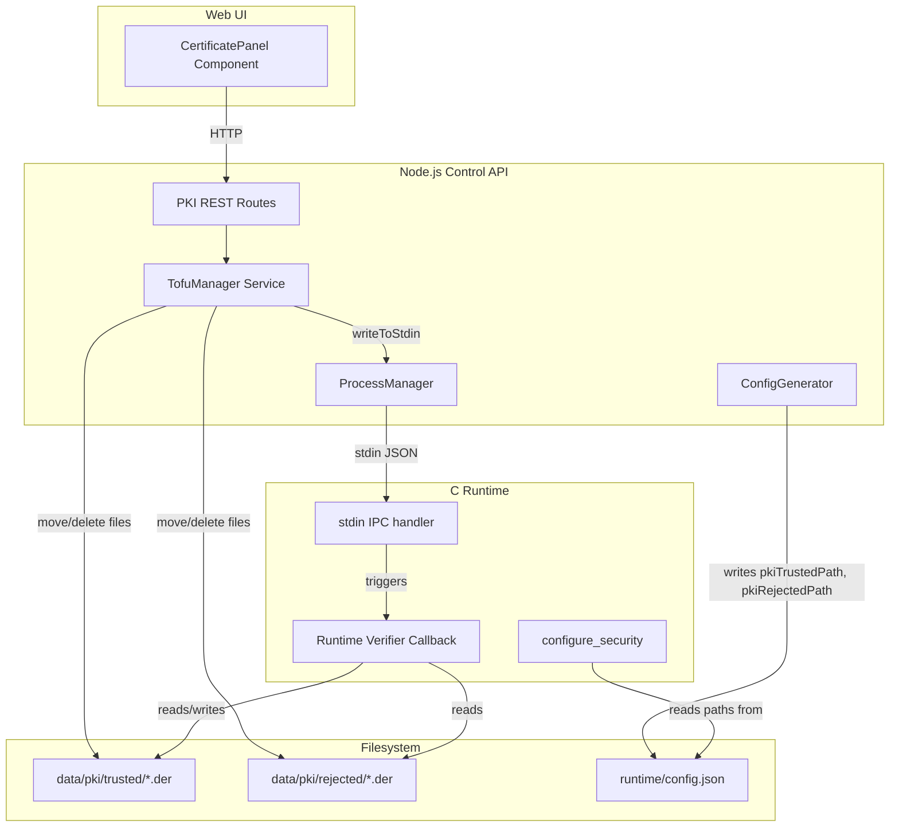
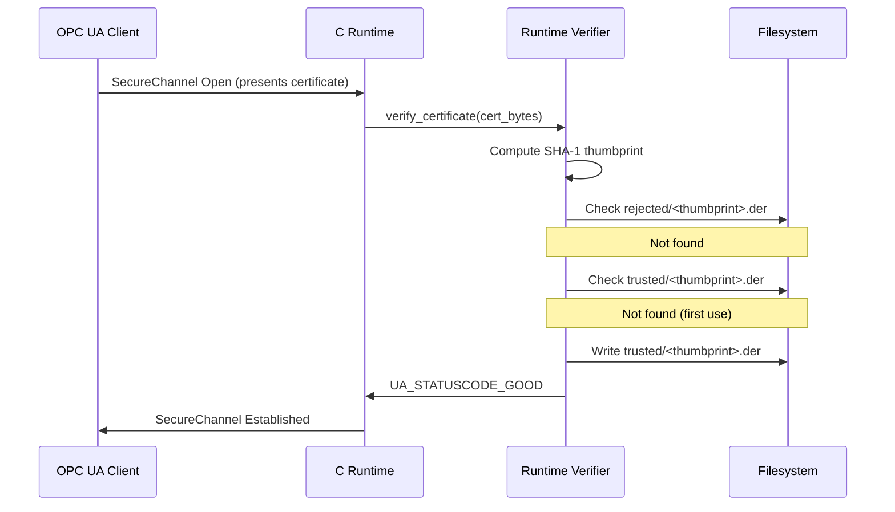
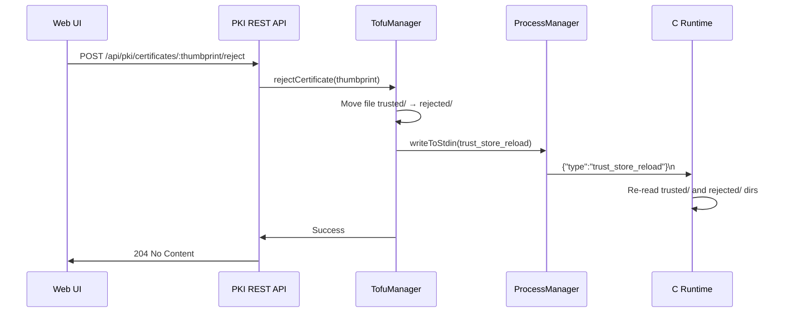

# Design Document: TOFU Client Certificate Trust

## Overview

This feature replaces the current `UA_CertificateVerification_AcceptAll` certificate verification in the open62541 C runtime with a Trust On First Use (TOFU) model. When an unknown OPC UA client connects for the first time, its certificate is automatically accepted and persisted to disk. Subsequent connections verify the certificate against the stored trust/reject lists. Operators manage certificate trust through REST API endpoints and a Web UI panel.

The system spans three architectural layers:
1. **TOFU Manager** (Node.js) — manages PKI directories, provides REST API for trust operations, and signals the runtime on changes.
2. **Runtime Verifier** (C) — custom certificate verification callback that checks certificates against on-disk trust/reject stores and implements TOFU on first contact.
3. **Web UI** (React) — certificate management panel within the existing Security Settings page.

## Architecture



### Data Flow: First Client Connection (TOFU)



### Data Flow: Certificate Rejection by Operator



## Components and Interfaces

### 1. TofuManager Service (`src/tofu-manager/index.ts`)

Responsible for PKI directory lifecycle, certificate file operations, and coordinating trust store reloads.

```typescript
export interface CertificateInfo {
  thumbprint: string;
  status: 'trusted' | 'rejected';
  subject: string;
  issuer: string;
  notBefore: string; // ISO 8601
  notAfter: string;  // ISO 8601
  fileSize: number;
}

export class TofuManager {
  constructor(
    private readonly pkiBasePath: string,
    private readonly processManager: ProcessManager
  ) {}

  /** Create data/pki/trusted/ and data/pki/rejected/ if they don't exist. */
  async initialize(): Promise<void>;

  /** List all certificates from both stores, sorted by thumbprint. */
  listCertificates(): CertificateInfo[];

  /** Move certificate from trusted → rejected. */
  rejectCertificate(thumbprint: string): void;

  /** Move certificate from rejected → trusted. */
  trustCertificate(thumbprint: string): void;

  /** Delete certificate from whichever store it resides in. */
  deleteCertificate(thumbprint: string): void;

  /** Get absolute paths for the trust and reject directories. */
  getPkiPaths(): { trustedPath: string; rejectedPath: string };

  /** Send trust_store_reload signal to the runtime if running. */
  private signalReload(): void;
}
```

**Design Decisions:**
- TofuManager uses synchronous file operations (`fs.renameSync`, `fs.unlinkSync`) for atomicity — a move is a single syscall on the same filesystem.
- Certificate parsing uses `node-forge` (already a project dependency for the cert-generator) to extract subject/issuer/validity from DER files.
- Thumbprint validation (40-char hex) is handled by a shared utility function reused by both the manager and routes.

### 2. PKI REST API Routes (`src/api/routes/pki.ts`)

```typescript
export function createPkiRouter(tofuManager: TofuManager): Router;
```

| Method | Endpoint | Auth | Description |
|--------|----------|------|-------------|
| GET | `/api/pki/certificates` | No | List all certificates |
| POST | `/api/pki/certificates/:thumbprint/reject` | Yes | Reject a trusted certificate |
| POST | `/api/pki/certificates/:thumbprint/trust` | Yes | Re-trust a rejected certificate |
| DELETE | `/api/pki/certificates/:thumbprint` | Yes | Delete a certificate permanently |

**Thumbprint Validation Middleware:** Validates `:thumbprint` as a 40-character lowercase hex string (`/^[0-9a-f]{40}$/`). Returns 400 with `VALIDATION_ERROR` code if invalid.

**Response format:** Mutation endpoints return 204 (no body) on success. Error responses follow the existing `ErrorResponse` type with appropriate codes (`NOT_FOUND`, `VALIDATION_ERROR`, `CONFLICT`, `INTERNAL_ERROR`).

### 3. Custom Certificate Verification Callback (C Runtime)

A new function registered via `UA_CertificateVerification` that replaces the AcceptAll verifier when security mode is Sign or SignAndEncrypt.

```c
/* New source file: runtime/src/tofu_verifier.c */

typedef struct {
    char trusted_path[4096];
    char rejected_path[4096];
} TofuVerifierContext;

/**
 * Custom verification callback implementing TOFU.
 * Returns:
 *   UA_STATUSCODE_BADCERTIFICATEUNTRUSTED if cert is in reject store or dirs unreadable
 *   UA_STATUSCODE_GOOD if cert is in trust store or is new (first use)
 */
static UA_StatusCode
tofu_verify_certificate(void *verificationContext,
                        const UA_ByteString *certificate);

/** Compute SHA-1 thumbprint of DER-encoded certificate as hex string. */
static void compute_thumbprint(const UA_ByteString *cert, char *out_hex);

/** Re-read trust and reject directories (called on trust_store_reload IPC). */
void tofu_reload_trust_store(TofuVerifierContext *ctx);
```

**Design Decisions:**
- The verifier checks the reject store FIRST (Requirement 3.3: if in both stores, treat as rejected).
- File existence is checked per-connection via `access()` or `stat()` on the expected path `<dir>/<thumbprint>.der`. This avoids maintaining an in-memory cache that could go stale.
- For the `trust_store_reload` IPC message, the runtime doesn't need to re-read all files eagerly. Since verification already checks the filesystem per-connection, the reload signal primarily serves as a log confirmation. However, if an in-memory optimization is added later, reload would refresh that cache.
- SHA-1 is computed using open62541's built-in `UA_Sha1` utility or a minimal inline implementation (open62541 bundles mbedTLS or OpenSSL depending on build).

### 4. IPC Extension: Trust Store Reload

The existing stdin IPC protocol uses newline-delimited JSON with a `"type"` discriminator. A new message type is added:

```json
{"type":"trust_store_reload"}
```

The `apply_value_update` function in `main.c` is extended to recognize this type and invoke the reload handler:

```c
if (strcmp(type_str, "trust_store_reload") == 0) {
    printf("[TOFU] Trust store reload requested via IPC\n");
    /* No-op if using direct filesystem checks per connection.
     * If caching is added, refresh the cache here. */
    cJSON_Delete(root);
    return;
}
```

The Node.js side sends this via `ProcessManager.writeToStdin()`:

```typescript
private signalReload(): void {
  const status = this.processManager.getStatus();
  if (status.state !== 'running') {
    console.log('[TofuManager] Runtime not running, skipping reload signal');
    return;
  }
  const ok = this.processManager.writeToStdin(
    JSON.stringify({ type: 'trust_store_reload' }) + '\n'
  );
  if (!ok) {
    console.warn('[TofuManager] Failed to write reload signal to stdin');
  }
}
```

### 5. ConfigGenerator Changes

The `SecurityConfigOutput` type is extended:

```typescript
export interface SecurityConfigOutput {
  mode: 'None' | 'Sign' | 'SignAndEncrypt';
  certificatePath?: string;
  privateKeyPath?: string;
  applicationUri?: string;
  pkiTrustedPath?: string;   // NEW
  pkiRejectedPath?: string;  // NEW
}
```

In `ConfigGenerator.buildSecurityConfig()`, when mode is Sign or SignAndEncrypt:

```typescript
if (row.mode !== 'None') {
  config.pkiTrustedPath = resolve('data/pki/trusted');
  config.pkiRejectedPath = resolve('data/pki/rejected');
}
```

If mode is "None", these fields are omitted.

**Fallback rule** (Requirement 11.4): If mode is Sign/SignAndEncrypt but the PKI directories don't exist or paths can't be resolved, fall back to mode "None" and log a warning. This mirrors the existing fallback for missing certificate/key paths.

### 6. Web UI: CertificatePanel Component

A new `CertificatePanel` component rendered inside the existing `SecuritySettings` page, below the current certificate sections.

```typescript
// web/src/components/CertificatePanel.tsx

interface PkiCertificate {
  thumbprint: string;
  status: 'trusted' | 'rejected';
  subject: string;
  issuer: string;
  notBefore: string;
  notAfter: string;
  fileSize: number;
}

export function CertificatePanel(): JSX.Element;
```

**UI Structure:**
- Table with columns: Thumbprint (first 16 chars), Subject, Status (badge), Expiry (YYYY-MM-DD)
- Each row has action buttons: Reject (for trusted), Trust (for rejected), Delete (for all)
- Delete shows a confirmation modal (consistent with existing `showConfirmDialog` pattern in SecuritySettings)
- Empty state: "No client certificates have been received yet."
- Error state: Inline red text preserving the current list (consistent with existing error patterns)
- Uses TanStack React Query with `queryKey: ['pki-certificates']` and invalidation on mutations

**API client additions** (`web/src/api.ts`):

```typescript
export function getPkiCertificates(): Promise<PkiCertificate[]>;
export function rejectPkiCertificate(thumbprint: string): Promise<void>;
export function trustPkiCertificate(thumbprint: string): Promise<void>;
export function deletePkiCertificate(thumbprint: string): Promise<void>;
```

## Data Models

### Certificate File Storage (Filesystem)

```
data/pki/
├── trusted/
│   ├── a1b2c3d4e5f6a1b2c3d4e5f6a1b2c3d4e5f6a1b2.der
│   └── ...
└── rejected/
    ├── f1e2d3c4b5a6f1e2d3c4b5a6f1e2d3c4b5a6f1e2.der
    └── ...
```

- Filenames are the SHA-1 thumbprint (40 lowercase hex chars) + `.der` extension.
- Files contain raw DER-encoded X.509 certificate bytes.
- No database table is needed — the filesystem IS the source of truth. This avoids sync issues between DB and disk.

### Runtime Configuration JSON (extended security section)

```json
{
  "security": {
    "mode": "SignAndEncrypt",
    "certificatePath": "/abs/path/data/certs/server.der",
    "privateKeyPath": "/abs/path/data/certs/server.key",
    "applicationUri": "urn:opcua-light-server:application",
    "pkiTrustedPath": "/abs/path/data/pki/trusted",
    "pkiRejectedPath": "/abs/path/data/pki/rejected"
  }
}
```

### IPC Messages (stdin, newline-delimited JSON)

| Type | Direction | Purpose |
|------|-----------|---------|
| `value_update` | API → Runtime | Existing: update node values |
| `trust_store_reload` | API → Runtime | New: signal runtime to re-read trust stores |

### CertificateInfo DTO (API response)

```typescript
interface CertificateInfo {
  thumbprint: string;         // 40-char lowercase hex
  status: 'trusted' | 'rejected';
  subject: string;            // CN from certificate subject
  issuer: string;             // CN from certificate issuer
  notBefore: string;          // ISO 8601 datetime
  notAfter: string;           // ISO 8601 datetime
  fileSize: number;           // bytes
}
```

### Thumbprint Validation

```typescript
const THUMBPRINT_REGEX = /^[0-9a-f]{40}$/;

export function isValidThumbprint(value: string): boolean {
  return THUMBPRINT_REGEX.test(value);
}
```


## Correctness Properties

*A property is a characteristic or behavior that should hold true across all valid executions of a system — essentially, a formal statement about what the system should do. Properties serve as the bridge between human-readable specifications and machine-verifiable correctness guarantees.*

### Property 1: Initialization Idempotency

*For any* set of pre-existing files in the PKI directories (trusted/ and rejected/), calling `TofuManager.initialize()` SHALL leave all existing files and their contents unchanged.

**Validates: Requirements 1.4**

### Property 2: TOFU Acceptance and Persistence

*For any* valid DER-encoded certificate whose SHA-1 thumbprint does not match any filename in either the trust store or reject store, the verification callback SHALL return `UA_STATUSCODE_GOOD` AND a file named `<thumbprint>.der` containing the exact certificate bytes SHALL exist in the trust store directory afterward.

**Validates: Requirements 2.1, 10.5**

### Property 3: Thumbprint Computation Determinism

*For any* byte sequence, the SHA-1 thumbprint computation SHALL produce a 40-character lowercase hexadecimal string that matches the standard SHA-1 hash of those bytes. Additionally, the same input SHALL always produce the same output (deterministic).

**Validates: Requirements 2.2, 10.2**

### Property 4: Trusted Certificate Acceptance

*For any* certificate whose SHA-1 thumbprint matches a filename (without extension) in the trust store directory AND does NOT match any filename in the reject store, the verification callback SHALL return `UA_STATUSCODE_GOOD`.

**Validates: Requirements 3.1, 10.4**

### Property 5: Rejected Certificate Denial

*For any* certificate whose SHA-1 thumbprint matches a filename (without extension) in the reject store directory, the verification callback SHALL return `UA_STATUSCODE_BADCERTIFICATEUNTRUSTED`, regardless of whether the same thumbprint also exists in the trust store.

**Validates: Requirements 3.2, 3.3, 10.3**

### Property 6: Reject Operation State Transition

*For any* valid 40-character lowercase hex thumbprint that corresponds to a file in the trust store, calling `rejectCertificate(thumbprint)` SHALL result in: (a) the file no longer existing in the trust store, AND (b) a file with identical content existing in the reject store under the same filename.

**Validates: Requirements 4.1**

### Property 7: Trust Operation State Transition

*For any* valid 40-character lowercase hex thumbprint that corresponds to a file in the reject store AND does not correspond to a file in the trust store, calling `trustCertificate(thumbprint)` SHALL result in: (a) the file no longer existing in the reject store, AND (b) a file with identical content existing in the trust store under the same filename.

**Validates: Requirements 5.1**

### Property 8: Delete Operation Removal

*For any* valid 40-character lowercase hex thumbprint that corresponds to a file in either the trust store or reject store, calling `deleteCertificate(thumbprint)` SHALL result in that file no longer existing in either store.

**Validates: Requirements 7.1**

### Property 9: Non-Existent Thumbprint Returns 404

*For any* valid 40-character lowercase hex thumbprint that does NOT correspond to a file in the expected store (trust store for reject operations, reject store for trust operations, either store for delete operations), the operation SHALL return a 404 error response.

**Validates: Requirements 4.2, 5.2, 7.2**

### Property 10: Invalid Thumbprint Validation

*For any* string that does NOT match the pattern `/^[0-9a-f]{40}$/`, all PKI endpoints (reject, trust, delete) SHALL return a 400 error response with code `VALIDATION_ERROR`, without performing any filesystem operations.

**Validates: Requirements 4.4, 7.4, 8.8**

### Property 11: Certificate Listing Completeness and Ordering

*For any* set of valid DER certificate files distributed across the trust store and reject store, calling `listCertificates()` SHALL return a list where: (a) every valid certificate file is represented exactly once, (b) each entry contains thumbprint, status, subject, issuer, notBefore, notAfter, and fileSize fields, and (c) entries are sorted alphabetically by thumbprint in ascending order.

**Validates: Requirements 6.1, 6.2**

### Property 12: Config Generator PKI Path Inclusion

*For any* security configuration where mode is "Sign" or "SignAndEncrypt" AND certificate and key paths are configured, the generated config JSON SHALL contain `pkiTrustedPath` and `pkiRejectedPath` fields with absolute filesystem paths. Conversely, *for any* configuration where mode is "None", the generated config JSON SHALL NOT contain these fields.

**Validates: Requirements 11.1, 11.2**

### Property 13: Authentication Enforcement on Mutations

*For any* HTTP request with method POST or DELETE to a `/api/pki/certificates/*` endpoint that does not include valid authentication credentials, the API SHALL return a 401 status code without performing the requested operation.

**Validates: Requirements 8.5, 8.7**

## Error Handling

### Node.js (TofuManager & API Routes)

| Scenario | Behavior | HTTP Status |
|----------|----------|-------------|
| PKI directory creation fails on startup | Log error, prevent runtime start | N/A (startup) |
| Certificate file unreadable/malformed in listing | Skip that entry, continue others | 200 (partial) |
| Thumbprint format invalid | Return validation error | 400 |
| Certificate not found in expected store | Return not found error | 404 |
| Certificate already in target store (trust op) | Return conflict error | 409 |
| Filesystem move/delete fails | Return internal error, preserve original state | 500 |
| Runtime not running when reload needed | Skip reload, log deferral | N/A (silent) |
| stdin write fails | Log warning, operation still succeeds | N/A (best-effort) |

### C Runtime (Certificate Verifier)

| Scenario | Behavior | OPC UA Status Code |
|----------|----------|-------------------|
| Certificate in reject store | Reject connection | `UA_STATUSCODE_BADCERTIFICATEUNTRUSTED` |
| Certificate in both stores | Reject connection | `UA_STATUSCODE_BADCERTIFICATEUNTRUSTED` |
| Trust/reject directories unreadable | Reject connection | `UA_STATUSCODE_BADCERTIFICATEUNTRUSTED` |
| Save to trust store fails (TOFU) | Accept connection, log error | `UA_STATUSCODE_GOOD` |
| Normal trusted/first-use certificate | Accept connection | `UA_STATUSCODE_GOOD` |

**Principle:** The runtime errs on the side of security (reject) for all error conditions EXCEPT the initial TOFU save failure, where availability takes priority to avoid blocking new clients due to transient filesystem issues.

## Testing Strategy

### Test Organization

Following the existing 4-project Vitest workspace:

| Project | Tests | Location |
|---------|-------|----------|
| `unit` | TofuManager operations, PKI route handlers, thumbprint validation, config generator changes | `tests/unit/tofu-manager/`, `tests/unit/routes/pki.test.ts` |
| `property` | Correctness properties 1–13 using fast-check | `tests/property/tofu-manager.test.ts` |
| `integration` | Full API flow with filesystem, runtime IPC | `tests/integration/pki-api.test.ts` |
| `components` | CertificatePanel rendering, interactions, error states | `tests/components/CertificatePanel.test.tsx` |

### Property-Based Testing Configuration

- **Library:** fast-check 3
- **Minimum iterations:** 100 per property
- **Timeout:** 30 seconds (per existing `property` project config)
- **Tag format:** `Feature: tofu-client-certificate-trust, Property N: <title>`

Each property from the Correctness Properties section is implemented as a single `fc.assert(fc.property(...))` test. Generators produce:
- Random DER-like byte arrays (valid length, random content) for certificate simulation
- Random 40-char hex strings for valid thumbprints
- Random invalid strings for validation testing
- Random filesystem states (sets of pre-existing files in trusted/rejected dirs)

### Unit Tests (Focused Examples)

- `TofuManager.initialize()` creates missing directories
- `TofuManager.initialize()` handles permission errors gracefully
- `rejectCertificate()` with already-rejected cert returns 404
- `trustCertificate()` with cert already in trust store returns 409
- Malformed DER files are skipped in listing
- IPC reload signal is sent after each mutation
- IPC reload is skipped when runtime is stopped
- Route auth middleware blocks unauthenticated mutations

### Integration Tests

- Full lifecycle: start API → create PKI dirs → start runtime → client connects (TOFU) → reject via API → verify client rejected
- Reload timing: verify runtime picks up trust store changes within 1 second
- Config generator end-to-end: DB → JSON with PKI paths → runtime reads paths

### Component Tests (React)

- CertificatePanel renders table with mock data
- CertificatePanel shows empty state when no certificates
- Reject button triggers API call and query invalidation
- Trust button triggers API call and query invalidation
- Delete button shows confirmation dialog before proceeding
- API error displays inline error message without modifying list
